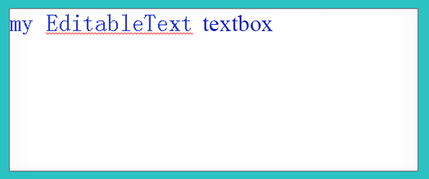
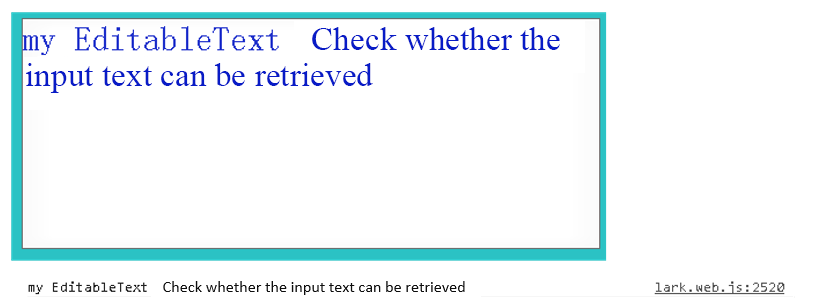

### 基础输入控件 EditableText

EUI 提供了输入文本控件，使用 `eui.EditableText` 可以创建可供用户输入的文本控件。 `eui.EditableText` 继承自 `egret.TextInput` ,也就是说它可以使用 `egret.TextFild` 和 `egret.TextInput` 的属性和方法。文本对象的用法可以参考：[创建文本](../../../../Engine2D/textField/createText/README.md).

首先准备一张图片作为背景素材:


新建一个 `EditableTextDemo` 类，并绘制一张背景，具体代码如下：


``` TypeScript
class EditableTextDemo extends eui.Group {
    public constructor () {
        super();
    }
    //新建一个背景图片
    private background:eui.Image = new eui.Image();
    //新建一个输入框
    private myEditableText:eui.EditableText = new eui.EditableText();    

}
```

通过 `eui.EditableText()` 新建一个输入文本控件，代码如下。

``` TypeScript
class EditableTextDemo extends eui.Group {
    public constructor () {
        super();
        //指定图片素材，这里使用上面的图片，并放入相应文件夹下    
        this.background.source = "resource/assets/checkbox_unselect.png";  
        //指定图片的九宫格，我们可以复习一下前面章节的内容
        this.background.scale9Grid = new egret.Rectangle(1.5,1.5,20,20); 
        //指定其宽和高，用来当做背景.
        this.background.width = 500;                                       
        this.background.height = 200;
        //将背景添加到显示列表
        this.addChild(this.background);                                    
        //指定默认文本，用户可以自己输入，也可以将其删除
        this.myEditableText.text = "my EditableText";
        //指定文本的颜色。
        this.myEditableText.textColor = 0x2233cc;                          
        //指定我们的文本输入框的宽和高    
        this.myEditableText.width = this.background.width;                 
        this.myEditableText.height = this.background.height; 
        //设置我们的文本左边距为零
        this.myEditableText.left = 0;                                      
        //将他添加到显示列表
        this.addChild(this.myEditableText);                                

    }
    private background:eui.Image = new eui.Image();
    private myEditableText:eui.EditableText = new eui.EditableText();

}
```

`EditableTextDemo` 类的实例需要被添加至舞台才可以显示出来。编译运行项目，效果如下。



同时，可以操作 `myEditableText` 的其他属性，比如说添加自动换行，添加密码显示等。在上面的构造函数中可以添加下面的代码：


``` TypeScript

//添加密码显示 添加在 constructor () 内.
this.myEditableText.displayAsPassword = true;                             

```
效果如下：


当用户输入了文本之后，可以通过 `text` 属性获得用户输入的内容。修改上面代码，添加在 constructor () 内，具体如下：

``` TypeScript
//让文本能被显示出来.
this.myEditableText.displayAsPassword = fale; 
//表示文本字段是否按单词换行。如果值为 true，则该文本字段按单词换行；反之则该文本字段按字符换行。
this.myEditableText.wordWrap = true;                                     
//添加监听，监听用户的输入
this.myEditableText.addEventListener(egret.Event.CHANGE,this.onChang,this);             
```

再添加一个处理函数，在 EditableTextDemo 内添加：
``` TypeScript
private onChang(e:egret.Event){
    egret.log(e.target.text);
}    
```

效果如下:



### 输入控件 TextInput

TextInput 控件是文本输入控件。它的默认皮肤如下：

```
<?xml version='1.0' encoding='utf-8'?> <e:Skin class="skins.TextInputSkin" minHeight="40" minWidth="300" 
            states="normal,disabled,normalWithPrompt,disabledWithPrompt" xmlns:e="http://ns.egret.com/eui"> <e:Image width="100%" height="100%" scale9Grid="1,3,8,8" source="button_up_png"/> <e:Rect height="100%" width="100%" fillColor="0xffffff"/> <e:EditableText id="textDisplay" verticalCenter="0" left="10" right="10"
	         textColor="0x000000" textColor.disabled="0xff0000" 
	         width="200" height="100%" size="20" /> <e:Label id="promptDisplay" verticalCenter="0" left="10" right="10"
	         textColor="0xa9a9a9" width="100%" height="24" size="20" 
	         touchEnabled="false" includeIn="normalWithPrompt,disabledWithPrompt"/> </e:Skin>
```

它的皮肤需要包含一个 `EditableText` 文本实体输入组件 `textDisplay` 和一个 `Label` 组件 `promptDisplay`。我们可以选择使用给它添加一个背景,这样来组成一个 TextInput 的皮肤。

在程序中使用 TextInput 跟其他控件类似，可以参考下面代码:

```
var textInput = new eui.TextInput();
textInput.skinName = "resource/eui_skins/TextInputSkin.exml";
textInput.prompt = "请输入文字";
this.addChild(textInput);
```

通过设置 `protmpt` 属性来设置默认的文字。也可以通过 `textDisplay` 属性来取得文本输入组件。

