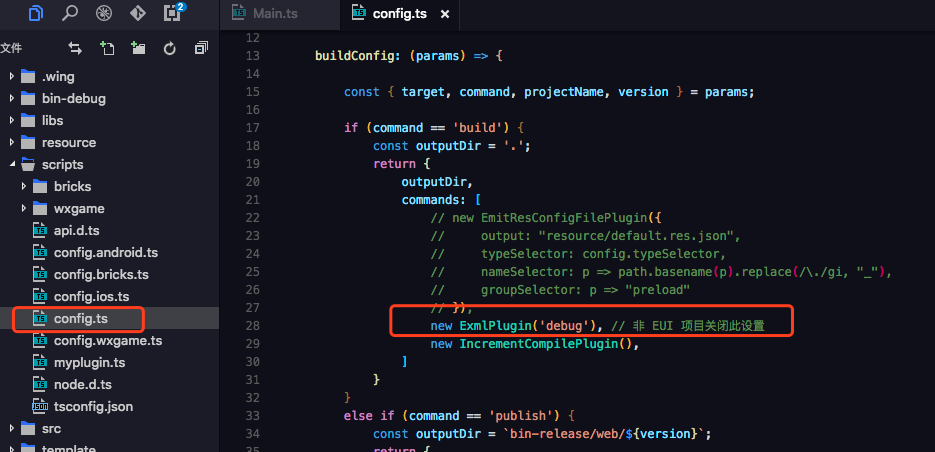

在 Egret 5.x 项目的 `scripts` 目录下，有个 `config.ts` 文件，里面可以配置 EUI 的编译模式


```
 if (command == 'build') {
 	......
 	new ExmlPlugin('debug'), // 非 EUI 项目关闭此设置
 }
 else if (command == 'publish') {
	......
 	new ExmlPlugin('commonjs'), // 非 EUI 项目关闭此设置
 }
```
如上面的代码所示，可以分别设置 `build`（即 debug 模式）和 `publish`（即发布模式）的编译模式。

编译模式有以下几种：

*  debug : 默认策略，用于开发环境
*  contents : 将 EXML 的内容写入到主题文件中
*  gjs : 将生成的JS文件写入到主题文件中
*  commonjs : 将EXML合并为一个 CommonJS 风格的文件
*  将EXML合并为一个含有解析方法和皮肤定义的文件，且皮肤抽离为一份配置
*  json : 将每个EXML文件生成一份配置

您可以根据项目需求来设置