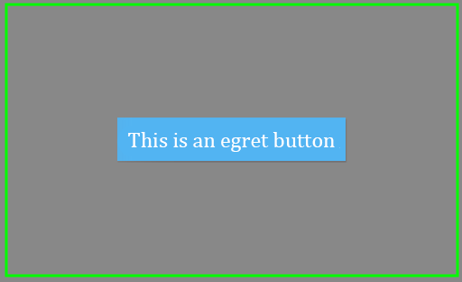
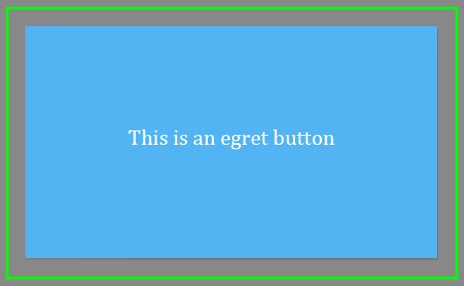
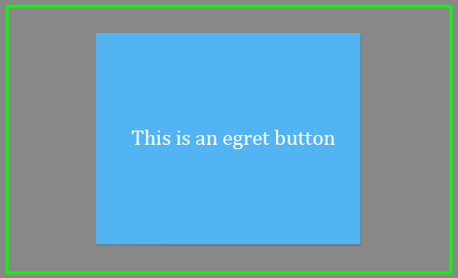

首先新建一个 eui 项目，使用：

```
egret create HelloEUI --type eui
```

下面的教程里使用的是该项目的默认皮肤。

这是Group的默认布局模式。在基本布局模式下，容器内的子项的定位方式，取决于每个子项的坐标设置。首先，创建一个 Group 容器，并设置其布局属性为基本布局：    
``` TypeScript
this.myGroup = new eui.Group();
this.addChild( this.myGroup );
this.myGroup.width = 400;
this.myGroup.height = 300;
this.myGroup.layout = new eui.BasicLayout();
``` 
其中预先定义了:
```
private  myGroup:eui.Group;
```
为了看清楚容器的边缘，在容器内先绘制一个与容器宽高一致的空心矩形：   
``` TypeScript
/// 绘制矩形用于显示 myGroup 的轮廓
var outline:egret.Shape = new egret.Shape;
outline.graphics.lineStyle(3,0x00ff00);
outline.graphics.beginFill(0x000000,0);
outline.graphics.drawRect(0,0,400,300);
outline.graphics.endFill();

this.myGroup.addChild( outline );
```
以上代码是基础代码，后边讲解中列出的代码段都在此基础上添加。   

## 绝对定位
基本布局的主要特征就是绝对定位，设置子项的 x 与 y 坐标即可设置其相对于容器的坐标位置。   
首先用坐标递增的方式放置4个按钮：     
``` TypeScript
for(var i:number=0;i<4;i++) {
    var btn:eui.Button = new eui.Button();
    btn.x = 25 +i*35;
    btn.y = 40+i*65;
    btn.label = "button "+i;
    this.myGroup.addChild(btn);
}
```     
效果如图：    
     

## 居中设定
上面设置的是子项的位置，至于尺寸，则是设置每个子项的`width`和`height`。上面所述的情况比较简单，即每个子项的位置和尺寸是确定的，是定值。但实际需求中，可能会比较复杂。比如有一个按钮，希望它能根据容器的尺寸，自动处于居中位置，不需要写代码来设置`x`和`y`坐标。此时有两个属性可用：     
- `horizontalCenter`     
- `verticalCenter`       

这两个值是定义对象的中心点与容器的中心点之间的差值。如果两项都设置为0，代表中心点完全重合，也就实现了自动居中功能。   
``` TypeScript
var btn:eui.Button = new eui.Button();
btn.label = "This is an egret button";
btn.horizontalCenter = 0;
btn.verticalCenter = 0;
this.myGroup.addChild( btn );
```       
效果如图：    
     

## 边距设定
假如需求更复杂一些，按钮不仅仅是居中，还始终和容器边界保持20像素的差值，需要用到的属性是：     
- `top`
- `bottom`
- `left`
- `right`

`top`的值，就是定义对象的上边界和容器的上边界之间的距离，其他3个值以此类推。设置如下：    
``` TypeScript
var btn:eui.Button = new eui.Button();
btn.label = "This is an egret button";
btn.top = 20;
btn.bottom = 20;
btn.left = 20;
btn.right = 20;
this.myGroup.addChild( btn );
```              
效果如图：    
   

## 百分比设定
在尺寸的定义上，可以使用百分比。比如要让按钮容器的尺寸一致，可以设置：    
``` TypeScript
var btn:eui.Button = new eui.Button();
btn.label = "This is an egret button";
btn.percentWidth = 60;
btn.percentHeight = 80;
this.myGroup.addChild( btn );
```        
> 可以根据需求，决定使用`percentWidth`,`percentHeight`还是`top`,`bottom`,`left`,`right`。`percentWidth`,`percentHeight`只能约束宽高，而`top`,`bottom`,`left`,`right`则同时约束了尺寸和位置`(x,y)`。     

为了使按钮在容器处于中心位置，可以在上一段代码基础上加入居中设定：   
``` TypeScript
btn.horizontalCenter = 0;
btn.verticalCenter = 0;
```              
效果如图：    
     

如图中效果所示，这些属性可以混合使用(相矛盾的设置除外)。   

完整的类定义如下：

```
class bascLayout extends egret.Sprite {
    private  myGroup:eui.Group;

    public  constructor () {

        super();

        this.myGroup = new eui.Group();
        this.myGroup.width = 400;
        this.myGroup.height = 300;
        this.addChild( this.myGroup );

        this.myGroup.layout = new eui.BasicLayout();
        
        var outline:egret.Shape = new egret.Shape;
        outline.graphics.lineStyle(3,0x00ff00);
        outline.graphics.beginFill(0x000000,0);
        outline.graphics.drawRect(0,0,400,300);
        outline.graphics.endFill();

        this.myGroup.addChild( outline );

        for(var i:number=0;i<4;i++) {
            var btn:eui.Button = new eui.Button();
            btn.x = 25 +i*35;
            btn.y = 40+i*65;
            btn.label = "button "+i;
          //这里先注释掉，需要的时候再添加到显示对象里面     
          //this.myGroup.addChild(btn);
        }

        var btn:eui.Button = new eui.Button();
        btn.label = "This is an egret button";
        btn.horizontalCenter = 0;
        btn.verticalCenter = 0;
      //这里先注释掉，需要的时候再添加到显示对象里面 
      //this.myGroup.addChild( btn );

        var btn:eui.Button = new eui.Button();
        btn.label = "This is an egret button";
        btn.top = 20;
        btn.bottom = 20;
        btn.left = 20;
        btn.right = 20;
      //这里先注释掉，需要的时候再添加到显示对象里面 
      //this.myGroup.addChild( btn );

        var btn:eui.Button = new eui.Button();
        btn.label = "This is an egret button";
        btn.percentWidth = 60;
        btn.percentHeight = 80;
        this.myGroup.addChild( btn );

        btn.horizontalCenter = 0;
        btn.verticalCenter = 0;

    }
}
```

文档类的完整定义如下:

```
class Main extends eui.UILayer {

    protected createChildren(): void {
        super.createChildren();
        
        //注入自定义的素材解析器
        let assetAdapter = new AssetAdapter();
        egret.registerImplementation("eui.IAssetAdapter", assetAdapter);
        egret.registerImplementation("eui.IThemeAdapter", new ThemeAdapter());
        
        var theme = new eui.Theme("resource/default.thm.json", this.stage);
        
        var button = new eui.Button();
        button.label = "Click!";
        button.horizontalCenter = 0;
        button.verticalCenter = 0;
        this.addChild(button);
        button.addEventListener(egret.TouchEvent.TOUCH_TAP,this.onButtonClick,this);
        
        // 这里是添加的代码        
        var base =  new bascLayout();
        base.x = 50;
        base.y = 50;

        this.addChild(base);
    }   
    private onButtonClick(e:egret.TouchEvent) { 
        var panel = new eui.Panel();
        panel.title = "Title";
        panel.horizontalCenter = 0;
        panel.verticalCenter = 0;
        this.addChild(panel);
    }
}
```


