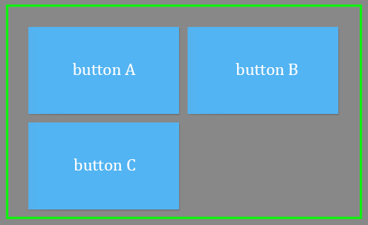

网格布局，既做横向排列，也做纵向排列，实现的效果像方格一样。可设置的属性主要包括：

* `horizontalGap`属性，设置子项之间的水平间距
* `verticalGap`属性，设置子项之间的垂直间距
* `columnAlign`属性，指定如何将完全可见列与容器宽度对齐。
* `rowAlign`属性，指定如何将完全可见行与容器高度对齐。
* `padding`属性，设置容器内间距，如果需要分开设置可以使用`paddingTop`,`paddingBottom`,`paddingLeft`,`paddingRight`
* `requestedColumnCount`属性，明确指定要显示的列数

> 其中`columnAlign`和`rowAlign`的设置对于边界对齐起重要作用，不同的设置形成的效果也不尽相同

仍然用 3 个按钮进行布局设置示例：

~~~ typescript
var btn1:eui.Button = new eui.Button();
btn1.label = "button A";
var btn2:eui.Button = new eui.Button();
btn2.label = "button B";
var btn3:eui.Button = new eui.Button();
btn3.label = "button C";
this.myGroup.addChild( btn1 );
this.myGroup.addChild( btn2 );
this.myGroup.addChild( btn3 );

var tLayout:eui.TileLayout = new eui.TileLayout();
tLayout.horizontalGap = 10;
tLayout.verticalGap = 10;
tLayout.columnAlign = eui.ColumnAlign.JUSTIFY_USING_WIDTH;
tLayout.rowAlign = eui.RowAlign.JUSTIFY_USING_HEIGHT;
tLayout.paddingTop = 30;
tLayout.paddingRight = 30;
tLayout.paddingLeft = 30;
tLayout.paddingBottom = 10;
tLayout.requestedColumnCount = 2;  /// 设置两列显示
this.myGroup.layout = tLayout;    /// 网格布局
~~~  

效果如图：

