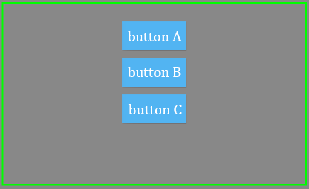

垂直布局的行为和水平布局类似，只不过方向变了，从水平方向变为竖直方向。     

>这里仍然使用我们前面的eui默认项目。

我们仍然使用水平布局所用的代码，将布局方式改变为垂直：    
``` TypeScript   
var btn1:eui.Button = new eui.Button();
btn1.label = "eui 按钮 A";
var btn2:eui.Button = new eui.Button();
btn2.label = "eui 按钮 B";
var btn3:eui.Button = new eui.Button();
btn3.label = "eui 按钮 C";
this.myGroup.addChild( btn1 );
this.myGroup.addChild( btn2 );
this.myGroup.addChild( btn3 );

var vLayout:eui.VerticalLayout = new eui.VerticalLayout();
vLayout.gap = 10;
vLayout.paddingTop = 30;
vLayout.horizontalAlign = egret.HorizontalAlign.CENTER;
this.myGroup.layout = vLayout; //设置问垂直布局
```    
效果如图：



对比水平布局可以看到，容器内的UI控件是作为一个整体参与布局的。   

