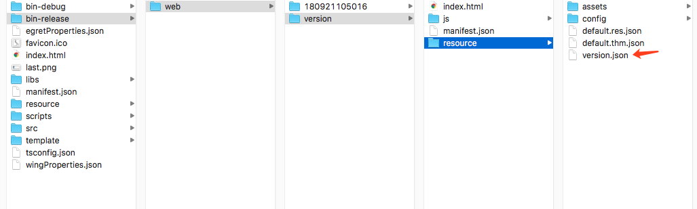
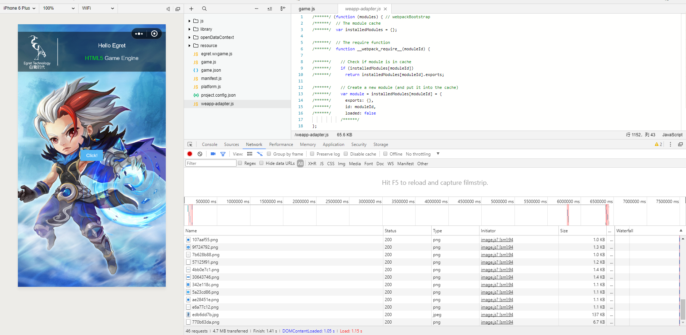

## 游戏资源版本控制功能的设计与实现
***
本篇文档主要以插件控制流为基础，实现自由定制的版本控制功能。
[示例demo下载](http://tool.egret-labs.org/DocZip/engine/VersionControlDemo.zip)
### 一. 生成版本资源
在新的发布插件流程中，开发者可以对所有资源和代码进行定制化处理。而版本控制就是对资源的名称进行规范化，增加版本号或校验码比对等功能。

打开示例 demo 的`scripts/resplugin.ts`文件

```
const crc32 = require("./crc32");
export class ResPlugin implements plugins.Command {

    // 版本控制信息
    private versionConfig = {};
    // 需要进行版本控制的文件夹
    private versionPath = "resource/assets/";
    // 版本信息保存路径,建议放入resource包里面，因为这个文件每次都需要加载，不需要放在cdn上。
    private versionConfigPath = "resource/version.json";
    constructor() {
    }

    async onFile(file: plugins.File) {
        //除去json可能存在的空格,如不需要，开发者可自行删除
        if (file.extname === ".json") {
            file.contents = new Buffer(JSON.stringify(JSON.parse(file.contents.toString())));
        }
        var path = file.origin;
        //对resource/assets下面的资源进行版本控制
        if (path.indexOf(this.versionPath) != -1 && (file.extname === ".mp3" || file.extname === ".fnt" || file.extname === ".json" || file.extname === ".png" || file.extname === ".jpg")) {
            path = path.replace(this.versionPath, "");
            this.versionConfig[path] = crc32(file.contents.toString());
            // 原始的文件夹+crc32码+后缀扩展名
            file.path = this.versionPath + this.versionConfig[path] + file.extname;
        }
        return file;
    }

    async onFinish(commandContext: plugins.CommandContext) {
        commandContext.createFile(this.versionConfigPath, new Buffer(JSON.stringify(this.versionConfig)));
    }
}
```
以上代码就是发布资源时进行版本控制处理的插件代码。我们选取了 `crc32` 作为版本校验的工具，相比较于 `Md5`，`crc32` 生成的代码更短，这样工程解析时需要加载的文件就会很小，更加高效。通过以上代码，会对项目中 `resource/assets` 文件夹里的文件进行版本控制。

```
else if (command == 'publish') {
    const outputDir = `bin-release/web/${version}`;
    return {
        outputDir,
        commands: [
            ...
            new ResPlugin(),//调用版本控制的逻辑
            ...
        ]
    }
}
```
如上图所示，在 `scripts/config.ts` 的发布控制流中调用自定义插件后，就可以进行版本管理。


如上图所示，执行 `egret publish` 命令后，会发布生成一个 `version.json` 文件，里面包含了资源的版本信息。

```
{
	//文件名：对应的 crc32 校验码
    "bg.jpg": "edb6dd7b",
    "egret_icon.png": "770b63da",
    "Button/button_down.png": "342e118c",
    "Button/button_up.png": "5a23cd86",
    "CheckBox/checkbox_select_disabled.png": "153da087",
    "CheckBox/checkbox_select_down.png": "c9ecc6fb",
	...
```

### 二. 解析版本资源
解析版本控制的示例文件为： `src/VersionManager.ts`

解析代码主要分为三部分，第一部分是加载version.json的配置，后续文件加载都会通过这个配置去寻找，第二部分是依据配置删除原有的缓存文件，最后一部分是运行时的资源路径的替换。这样开发者在使用的时候只需要修改版本号就能控制资源的维护。


```
init(): Promise<any> {
    if (RELEASE) {//发布模式
        return new Promise((resolve, reject) => {
        		...
        		//根据版本控制解析资源
        		...
        }
    } else {//debug 开发模式
        return Promise.resolve()
    }
}
```


上面代码兼容了发布模式和开发模式。

* 在开发模式下，不走版本控制的逻辑，还是用`resource/assets/bg.jpg`这种方式加载资源，便于替换资源调试项目。
* 在发布模式下，会用`resource/assets/edb6dd7b.jpg`这种方式加载，进行版本控制。


```
// 下面主要是对各种运行时的版本控制，
if (egret.Capabilities.runtimeType == egret.RuntimeType.WXGAME) {
    this.versionCacheWxgame();//微信小游戏
} else if (egret.Capabilities.runtimeType == egret.RuntimeType.WEB) {
    this.versionCacheWeb();//浏览器 H5
}
```
上面的示例代码兼容了网页模式和微信小游戏，这样一套代码就可以处理不同环境下的资源管理逻辑。


### 最终效果


上图为微信小游戏环境下，资源使用版本控制后的加载效果
