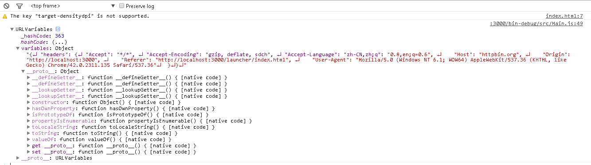

在网络通信中，不仅会加载一个简单的文本数据，还会加载一些图片资源、音频资源等等。

在针对不同格式数据的请求中，需要制定不同的处理方式。在Egret中，提供了五种可用的数据格式，分别是：

1.二进制格式

2.文本格式

3.URL编码格式

4.位图纹理格式

5.音频格式。

以上五种数据格式的设置均需要 `URLLOaderDataFormat` 类。如果想更改默认的文本格式，可以修改 `URLLoader` 中的 `dataFormat` 属性。 具体示例代码如下：

``` typescript
class NetDemo extends egret.DisplayObjectContainer
{
    public constructor()
    {
        super();
        this.addEventListener(egret.Event.ADDED_TO_STAGE,this.onAddToStage,this);
    }
    private urlloader:egret.URLLoader;
    private onAddToStage(event:egret.Event)
    {
        this.urlloader = new egret.URLLoader();
        this.urlloader.dataFormat = egret.URLLoaderDataFormat.VARIABLES;
        var urlreq:egret.URLRequest = new egret.URLRequest();
        urlreq.url = "http://httpbin.org/headers";
        this.urlloader.load( urlreq );
        this.urlloader.addEventListener(egret.Event.COMPLETE, this.onComplete, this);
    }
    private onComplete(event:egret.Event):void
    {
        console.log( this.urlloader.data );
    }
}   
``` 

其中有一行：

``` typescript
this.urlloader.dataFormat = egret.URLLoaderDataFormat.VARIABLES;
``` 

对加载的数据格式进行了修改，设置为“URL编码”格式。

编译后运行，效果如图：


