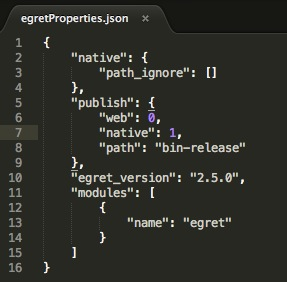
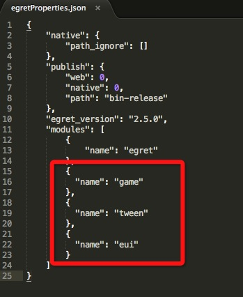
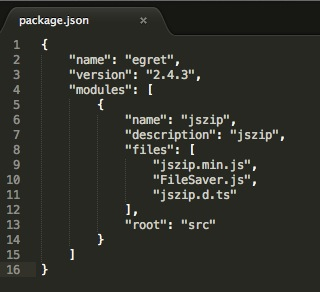
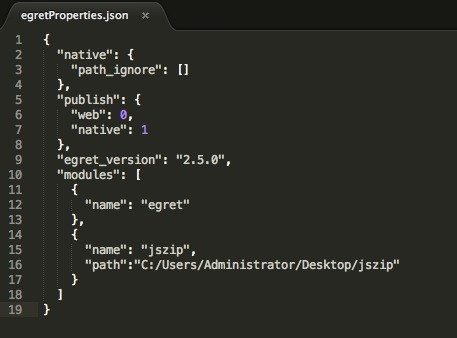
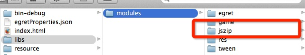
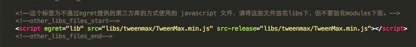

Egret 引擎更新到2.5版本后，我们重新构建了引擎，把以前的一些非核心内容(比如 MovieClip)都移到了扩展模块中，这样大大的减小了核心库的包体大小。同时也修改了扩展模块和第三方库的配置方法，使用起来更加便捷。下面就详细说明一下使用方法。

> Egret 2.5 之前版本的方法请参考：[旧版集成第三方库说明](http://edn.egret.com/cn20/index.php/article/index/id/172)

### 扩展模块
首先我们创建一个不引用任何模块的 Egret 空项目，在命令行中输入

``` egret create demo --type empty```

您会看到在项目文件夹中有一个 **egretProperties.json** 文件，这个文件描述了当前项目的一些信息。



其中包含一个 ```modules``` 字段,这部分就是用来配置扩展模块和第三方库的。
为了统一管理，Egret官方库按照模块呈现，这样设计的目的是避免加载不需要的模块，减少最终代码的体积，提高加载速度。
目前 Egret 的官方库分为8个模块
~~~
egret 必备的核心库
game 制作游戏会用到的类库，比如 MovieClip，URLLoader 等
res 资源加载库，所有涉及资源载入的工作，都可以通过这个模块来完成
tween 动画缓动类
dragonbones 龙骨动画库，用来制作一些复杂的动画效果
socket 用来通讯的 WebSocket 库
gui 老版本的 UI 库
eui 新增的 UI 库，使用起来更加的方便
~~~
您需要用哪个库，就配置哪个。比如我想用 ```game tween eui```这3个模块，只要像下面这样添加到配置文件里就可以了



然后命令行里使用 ```egret build -e```命令，引擎会自动把使用到的类库放到你的项目里。
你会发现，在项目的 ```libs/modules``` 文件夹下，原来只有一个 egret 文件夹，现在多了game eui 和tween三个文件夹，这些就是使用到的类库。
同样的，如果您在 **egretProperties.json** 配置文件里把模块名删掉，```libs/modules``` 文件夹下也会删掉对应的类库。

使用```egret create project_name```命令创建的项目，默认会带4个官方模块：```egret game res tween```

### 标准第三方库
#### 准备第三方库
第三方库可以是标准的 ts 库，也可是你在网上下载现成的 js 库，或者是自己写的 js 库。

由于 js 与 ts 在语法结构上的差异，在 ts 中不能直接调用 js 库的 API，所以TypeScript 团队提供了一套虚构声明语法，可以把现有代码的 API 用头文件的形式描述出来，扩展名为 d.ts（d.ts 命名会提醒编译器这种文件不需要编译）。这套虚构定义语法，让你不需要去实现函数体里的代码，类似定义interface和抽象类。

幸运的是目前，大多数流行的 js 类库已经由官方提供，或者由热心的社区开发者提供了对应的 d.ts 文件。当然，如果没有，您也可以自己编写。这里有篇教程讲得很详细，里边也包含一个庞大的 d.ts 库，以及管理这些库的方法：[使用JS类库](https://github.com/vilic/typescript-guide/blob/adaaef2281150e57657e5b67368f592a968fad8f/%E5%85%A5%E9%97%A8%E6%8C%87%E5%8D%97/%E4%BD%BF%E7%94%A8JS%E7%B1%BB%E5%BA%93.md)。

另外，由于一些流行的 js 库在快速更新，可能会有你找到的 d.ts 文件定义与 js 库的版本不一致而导致其中的 API 并没有完全对应的问题。遇到这种情况，要么寻找对应版本的 js 库，要么就需要您自己修改一下 d.ts 文件了。

至于具体修改方法，在对照原 d.ts 的基础上，你可能还需要熟悉 ts 接口方面的语法，可以参考这里：[ts接口教程](http://bbs.egret-labs.org/thread-885-1-1.html)。

#### 创建第三方模块
当我们准备好了要用的第三方库，还需要把它编译成 egret 需要的模块结构。
比如现在有一个名为 jszip 的 js 库，它包含3个文件
~~~
FileSaver.js
jszip.d.ts
jszip.min.js
~~~
**第 1 步** 要创建一个egret第三方库的项目文件，在命令行中输入
```egret create_lib jszip```

>第三方库项目与 Egret 项目不能嵌套。请不要在Egret 项目目录下面创建第三方库项目。

您会发现刚刚创建的第三方库项目和我们平时看到的 Egret 项目结构是不同的，里面包含2个空文件夹 ```bin、src、libs（如果没有请自行加上）```，还有一个 package.json 的配置文件。
**第 2 步** 把准备好的那3个文件拷贝到src文件夹中。

**第 3 步** 如果需要引用到其他的第三方库的代码，请把引用到的库文件（主要是 .d.ts 文件）放到 libs 目录下，libs 下不要放其他除了 .d.ts 外的其他 .ts 文件。

**第 4 步** 打开 package.json，将3个文件写入到 files 下面，如果文件有先后依赖顺序，一定得注意顺序。



**第 5 步** 在命令行中输入编译命令
```egret build jszip```

编译完成后，您会发现，在 bin 文件夹下，生成了一个 jszip 文件夹，里面有个3个文件

* **jszip.d.ts** 描述文件
* **jszip.js**  在 Egret 项目里，debug 模式时使用的 js 库
* **jszip.min.js** 在 Egret 项目里，发布后的正式版使用的 js 库，经过压缩，体积比 jszip.js 小

#### 使用第三方模块
和使用官方的扩展模块方法类似，在`modules`里填写相关的信息



~~~
"name": "jszip" 第三方库的名称
"path": "C:/Users/Administrator/Desktop/jszip" 刚才我们创建的第三方库的路径，绝对路径或者相对路径
~~~

> 这里需要注意的是，`jszip` 需要放置在 Egret 项目目录的外面。

最后命令行里使用 ```egret build -e``` 命令，引擎会把自定义的第三方库引用进来，在 ```libs/modules``` 路径下，你会看到 jszip 这个库，并且在 ```index.html``` 中的 ```modules_files``` 块中，会加入 jszip 的 script 标签。




>>> 所有需要对 api 的 .d.ts 文件，请放在 src 下面，即需要在 package.json 里配置，其他的请放在 libs 下面。

### 其他第三方库
除了使用 egret 提供的标准的第三方库的方式，我们还提供了另外一种可以通过 index.html 来直接配置的方式。

* 代码请放在 libs 目录下面，但是不要放在 libs/modules 下面。


* 在 index.html 中的 other_libs_files 块中，配置自定义的第三方库。需要填写 egret="lib" 以及 src-release。



>>> 所有放在 libs 目录下面的文件，以 ts 作为扩展名的文件只能是 ```.d.ts```（如 a.d.ts）文件，不能有纯 ts 文件（如 a.ts）。