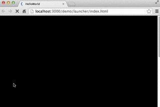

通常情况下，游戏中或多或少都会带有一些缓动动画。例如界面弹出，或者道具飞入飞出的特效等等。在制作这些缓动动画的时候我们仅仅 希望简单的办法实现这种移动或者变形缩放的效果。Egret中的 Tween 缓动动画类就为我们提供了相关的功能。

## 确保项目支持 Tween

从Egret 2.5 开始，以官方扩展模块的形式支持 Tween 。在现有的 Egret 项目中，修改egretProperties.json中的`modules`，添加 `tween` 模块：
```
 {
     "name": "tween"
 }
 ```
在项目所在目录内执行一次引擎编译：

```
egret build -e
```
本步骤已经完成，现在项目中既可以使用 Tween 相关的API了。

## 缓动基本用法

如果想使用缓动动画，你需要使用 Tween 这个类。 Tween 中封装了最常用的缓动动画功能，包括动画时间设定，缓动动画控制， 缓动效果控制等等。接下来我们看一个示例，如何制作一个最简单的缓动动画。

在这个示例中，我们绘制一个100*100的正方形，并且让他从x轴为50的位置移动到x轴为150的位置，运动过程使用时间为1s。



具体代码如下：

```
/// 代码段 A
class TweenTest extends egret.DisplayObjectContainer{
    public constructor(){
        super();
        this.addEventListener(egret.Event.ADDED_TO_STAGE,this.onAddToStage,this);
    }
    private onAddToStage(event:egret.Event){
        var shp:egret.Shape = new egret.Shape();
        shp.graphics.beginFill( 0x00ff00 );
        shp.graphics.drawRect( 0, 0, 100, 100 );
        shp.graphics.endFill();
        shp.x = 50;
        this.addChild( shp );
        var tw = egret.Tween.get( shp );
        tw.to( {x:150}, 1000 );
    }
}
```

如代码所示，每一个缓动对象是用 Tween.get 来的获得的，该方法需要传入用于缓动的目标对象，即例中的 shp ，然后通过 to 方法来给出需要设置缓动的具体参数。to 的第一个参数用于设置缓动属性以及目标值：例中的属性为 x ，目标值为 150，即会将 shp 从当前 x 坐标位置缓动到 x 坐标为 150；to 的第二个参数为缓动长度，单位为毫秒，例中的缓动长度为 1000毫秒，即 1 秒 。

## 缓动对象的基本控制参数

在定义缓动时，还可以传入一些属性参数来进行更进一步的定制。

* Tween.get 的第二个参数是可选的，这是一个对象参数，支持的属性有两个，分别说明：

* loop  布尔值，用于指定是否循环该缓动定义。true 为循环， false 为不循环，默认是不循环 (false) 。

useTicks  布尔值，用于指定是否使用帧同步。缓动的计算在计算缓动属性的插值上有两种方式，一种是每帧都考虑运行时间，每帧的时间长度对缓动造成的影响，即会自动计算时间差来计算当前帧的插值；另一种是架设每帧的时间长度是恒定的，这种情况当每帧的执行时间变化较大时，就会造成动画过程不稳定的现象。 该值默认是考虑时间差变化的 (false) 。

例如，给代码段 A 加入循环控制，只需要修改 Tween.get这一行为：

```
var tw = egret.Tween.get( shp, { loop:true} );
```

## 缓动对象的缓动变化事件

在 Tween 执行过程中，也许我们逻辑需要实时做一些变化。跟踪这个过程同样可以通过在 Tween.get 的第二个参数中，加入变化事件处理函数的定义来实现。

比如游戏中有猎物在做一个Tween运动过程中，猎人的枪口要实时瞄准，那么就需要在Tween的变化过程随时计算，修正猎人枪口的角度。

这里我们举个简单的例子，log出变化的坐标：

```
/// 代码段 B
var obj = { x:0 };

var funcChange = function():void{
    console.log( this.x );
}

egret.Tween.get( obj, { onChange:funcChange, onChangeObj:obj } )
    .to( {x:600}, 1000 , egret.Ease.backInOut );
```

## 缓动过程参数设定

对控制缓动过程的 to() 方法的第三个参数也需要特别说明一下。这个参数指定缓动函数，即整个动画过程中属性的变化方式，匀速或先快后慢，先慢后快等等。这个可以用现有的 Ease 中提供的函数常量来设定。 

例如代码段 B 中使用了 Ease.backInOut 缓动方程，该缓动方程的属性变化曲线是在缓动的开始和结束阶段均有一个短暂的反方向运动过程。 每个缓动函数具体的变化方式，可以从 [EDN中心的Tween效果演示](http://edn.egret.com/cn/article/index/id/53) 中看到直观效果。


## 缓动对象的其他方法

对于缓动的控制，可以设定若干其他方法。主要有以下两个：

* call 在某个缓动过程结束时，可以用 call 产生一个回调，直接将回调函数作为参数传给call就可以了。

* wait 用于多个缓动连续设定中设置中间的等待时间，也是以毫秒为单位。

这两个方法的用法可以在下一小节示例说明。


## 多个缓动过程的连续设定

缓动对象不只可以完成一次单独的缓动动画，通过连续调用缓动过程方法，可以连续进行多次缓动，完成相当复杂的动画过程。这里我们设计一个小方块在一个正方形轨道上运动的动画，会在每个角上产生回调事件 log 是哪个角，并在角上稍作停留，以下是完整代码：

```
/// 代码段 C
var shp:egret.Shape = new egret.Shape();
shp.graphics.beginFill( 0x00ff00 );
shp.graphics.drawRect( 0, 0, 100, 100 );
shp.graphics.endFill();
shp.x = 50;
shp.y = 50;
this.addChild( shp );
var tw = egret.Tween.get( shp, { loop:true} );
tw.to( {x:250}, 500 ).call( function(){ console.log( "右上角" ) } ).wait( 100 )
    .to( {y:250}, 500 ).call( function(){ console.log( "右下角" ) } ).wait( 100 )
    .to( {x:50}, 500 ).call( function(){ console.log( "左下角" ) } ).wait( 100 )
    .to( {y:50}, 500 ).call( function(){ console.log( "左上角" ) } ).wait( 100 );
```    
