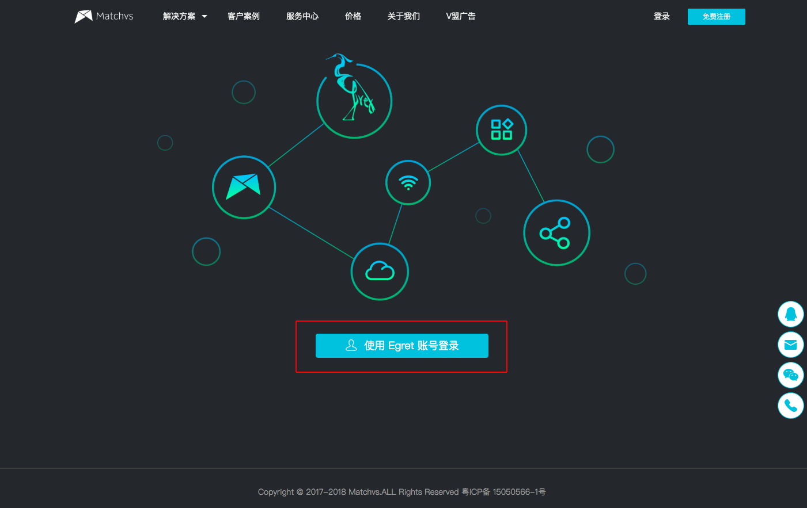

使用Egret Launcher创建项目，在面板中，选择服务类别中的Matchvs，勾选后创建的项目中即包含Matchvs SDK。

使用Matchvs服务，需要在Matchvs控制台中申请对应AppKey。可以在此面板中点击“登录控制台”按钮跳转到Matchvs后台进行登录与游戏的创建。

**注意：在Egret引擎中使用Matchvs服务，其Matchvs账号需要使用Egret账号授权方式创建，否则无法在引擎中使用Matchvs服务。**

