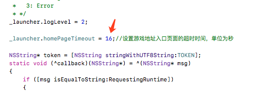
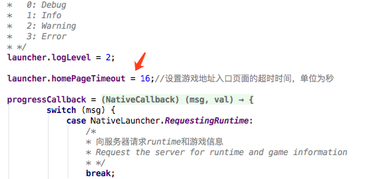
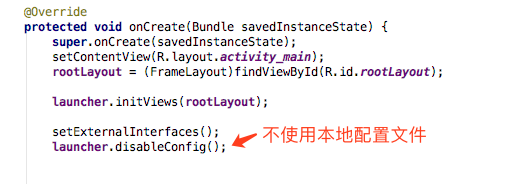
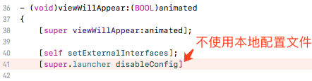
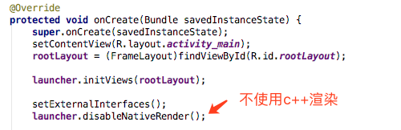
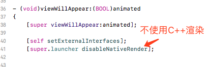
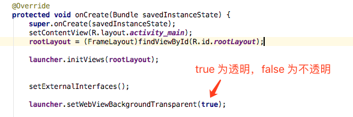
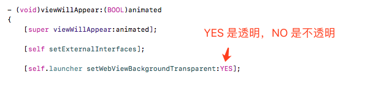

## 强制刷新页面

```
window.location.reload()
```
通过该方法，可以在微端里强制刷新页面，重新加载游戏

## 设置游戏地址入口页面的超时时间
该 API 在微端版本 v0.1.5 之后支持。

```
iOS 在 AppDelegate.mm 中设置
_launcher.homePageTimeout = xx;
```


```
安卓 在 AppDelegate.mm 中设置
_launcher.homePageTimeout = xx;
```



## 关闭本地配置文件
微端默认从网络读取配置信息，您也可以在 Launcher 创建项目的时候把配置信息放在本地。
如果您不想使用本地的配置文件，可以在工程中关闭。



安卓如上图所示，在 `setExternalInterfaces();` 下面增加一行`launcher.disableConfig();`



iOS如上图所示，在 `[self setExternalInterfaces];` 下面增加一行`[super.launcher disableConfig];`

## 关闭C++渲染
如果您使用 5.1.2 版本以上的引擎，在微端里会使用 C++ 渲染列表进行加速渲染，如果您不想使用该功能，可以在工程中关闭。



安卓如上图所示，在 `setExternalInterfaces();` 下面增加一行`launcher.disableNativeRender();`



iOS如上图所示，在 `[self setExternalInterfaces];` 下面增加一行`[super.launcher disableNativeRender];`

## 设置 webview 是否透明



安卓如上图所示，在 `setExternalInterfaces();` 下面增加一行`launcher.setWebViewBackgroundTransparent(true);`



iOS如上图所示，在 `[self setExternalInterfaces];` 下面增加一行`[self.launcher setWebViewBackgroundTransparent:YES];`


