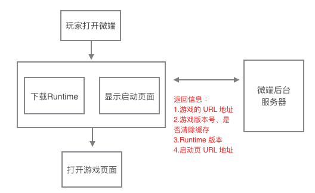
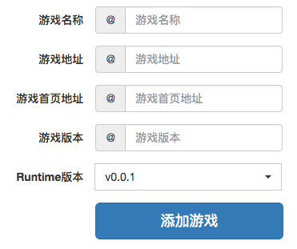
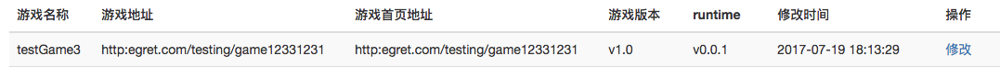
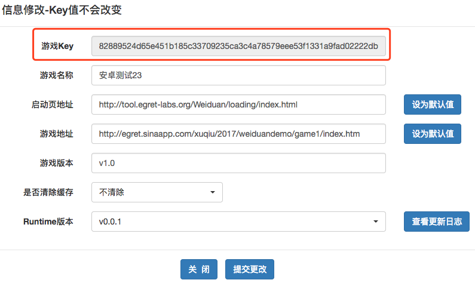
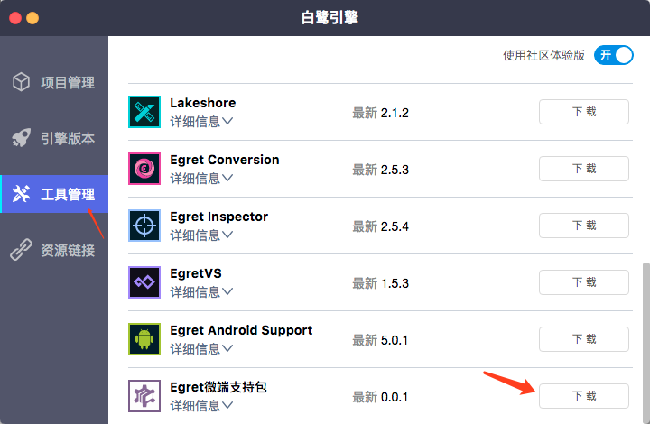

## 什么是微端
**微端**是我们发布的一个全新产品。它的体积很小，安卓系统的 apk安装包不到 600K，苹果系统的安装包不到 2MB。微端启动后会运行一个标准的 Egret Html5 游戏，所有的游戏资源都从网上获取，同时具有资源缓存功能。可以有效的降低用户的下载安装门槛。

此外，微端还解决了安卓浏览器碎片化的问题，比 webview 运行游戏更流畅。


上图是一个微端的工作流程图。

玩家在打开一个微端游戏后，会从微端服务器获取4个信息（这些信息可以在开发者后台自行修改，后面会有详细的说明）。

* **1.游戏的 URL 地址：**这个就是一会玩家要玩的 Html5 游戏的真实地址。
* **2.游戏的版本号和是否要清除缓存：**我们这次发布的技术内测版会把游戏过程中加载到的资源全部缓存下来。如果开发者修改了资源文件，需要在后台更新一个版本号，同时设置“清除缓存”，这样下次微端打开后，会根据版本号来判断是否要清除本地的缓存（目前仅有清除全部缓存这一种方式，未来会开放更多的缓存策略）
* **3.Runtime 版本：**Runtime就是运行游戏的播放器。如果开发者需要使用新功能或者遇到 bug 需要升级 Runtime，只要在后台设置一下，微端就会自动更新了。**注意：**由于 iOS 禁止热更新，远程更新 Runtime 的功能仅在安卓系统生效。iOS 需要通过重新发包来实现更新。
* **4.启动页 URL 地址：**Runtime 的体积大概是5MB左右（不同机型体积不同，会自动适配），下载它的时候也需要一段时间，此时可以显示一个启动页，减少用户等待的焦虑感。这是一个标准的 html 页面，可以是游戏的说明或广告，地址可以在开发者后台自行修改。

上面这些工作完成了以后，就会全屏打开游戏页面，后面的流程和在浏览器中运行 Egret Html5 游戏完全一致。
## 如何使用
#### 1）登陆微端开发者后台，创建一个游戏。

地址：[http://cloud.egret.com/](http://cloud.egret.com/)  使用论坛的账号密码即可登陆。

#### 2）创建一个游戏。
在后台页面填写所需的参数，这些参数在创建好以后都可以修改。



**游戏名称：**只是用于后台管理，可以和真实的游戏名不一致。

**游戏地址：**微端运行的 Html5 游戏地址。一般创建好了不需要修改，如果遇到服务器故障或被封等原因无法访问，可以修改成一个新的地址。**注意：**微端目前仅支持**4.1.0**以上引擎制作的游戏，地址必须是**.html**结尾才可以

**启动页地址：**下载 Runtime 时显示的启动页的地址，地址必须是**.html**结尾才可以。如果使用安卓工程里的启动页，请填写 local。**注意：**这个页面会被缓存下来，如果修改了启动页的内容，请更换网页地址。

**游戏版本：**第一个版本号。后续修改版本号时，微端可以判断是否清除缓存。

#### 3）获取游戏 Key 和修改参数



创建好游戏以后，如上图所示可以在列表中看到，点击最右侧的“修改”



在弹出页面中可以修改所有的参数。注意第一条的游戏 Key，这个在后面创建微端项目的时候会用到。

#### 4）下载技术内测版的 Launcher
要创建微端项目，需要使用技术内测版的 Egret Launcher，后面有下载链接。

#### 5）创建微端工程


安装好 Egret Launcher 以后，在工具管理面板中下载 “Egret 微端支持包”


下载完成后，在项目管理面板中，点击 “创建微端项目”


输入相关参数。其中的 “游戏KEY”  就是刚才通过微端开发者后台创建游戏后获取的。

点击“创建”按钮，就会根据项目类型自动创建一个微端工程。Android 是一个标准的 Android Studio 项目，iOS 是 标准的 xcode 项目。
在工程项目里修改图标，接入第三方 SDK 以后就可以发布安装程序了，这里就不多说了。

把发布出的安装包装到手机，就可以体验微端游戏了。

### 6）注意事项
* 1.微端只支持 webGL 模式，请确保 index.html 里的渲染模式
```
egret.runEgret({ renderMode: "webgl", audioType: 0 });
```

* 2.启动页会被缓存下来，如果要修改，请使用不同的 url 地址。
* 3.微端仅支持 4.1.0 以上的 Egret 引擎制作的游戏。
* 4.游戏地址的 html 页面里，不要使用 iframe 便签，否则可能无法解析。
* 5.因为 iOS 访问 http 服务器需要打开 NSAllowsArbitraryLoads，为了能让游戏网页正常访问，我们的模板项目里是默认打开的。
* 6.因为 iOS 禁止热更新，远程更新 Runtime 的功能仅在安卓系统生效。iOS 需要通过重新发包来实现更新。
* 7.RES 资源管理模块里有个设置最大并发加载线程数量的方法，在微端里建议改成8，会提高加载速度。
```
RES.setMaxLoadingThread(8);
```

### 7）相关下载和安卓版本要求
##### 技术内测版的 Egret Launcher

[Mac 版下载](http://tool.egret-labs.org/EgretLauncher/EgretLauncherForMicroClient-v0.6.6.dmg)

[Windows 版下载](http://tool.egret-labs.org/EgretLauncher/EgretLauncherForMicroClient-v0.6.6.exe)

##### 微端管理后台：[cloud.egret.com](http://cloud.egret.com)
[启动页 Demo 下载](http://tool.egret-labs.org/microclient/doc/zip/loadingPage_v4.1.zip)

##### 安卓版本要求：
Android默认编译SDK版本：23（19及以上都可以）

最低支持SDK版本：19

NDK版本：r10d

gradle版本：gradle-experimental:0.9.1

默认buildToolsVersion：25.0.2


