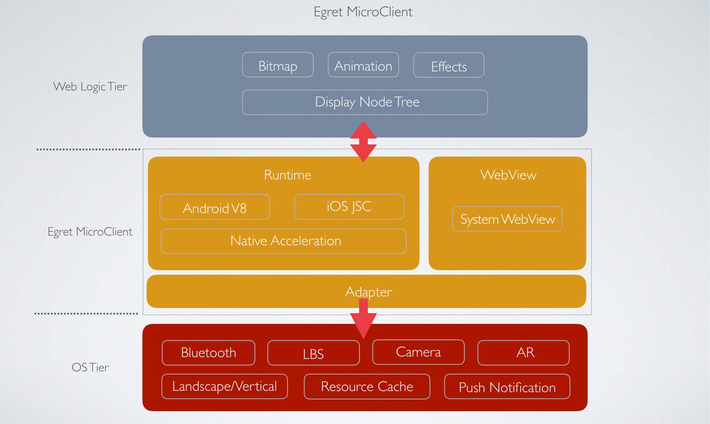
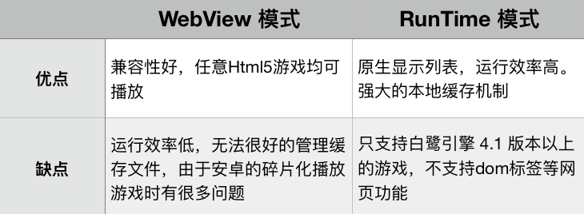
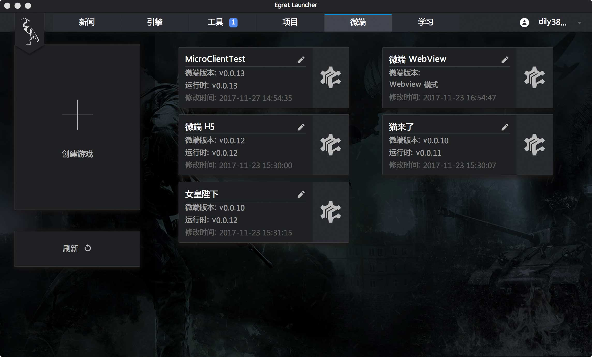
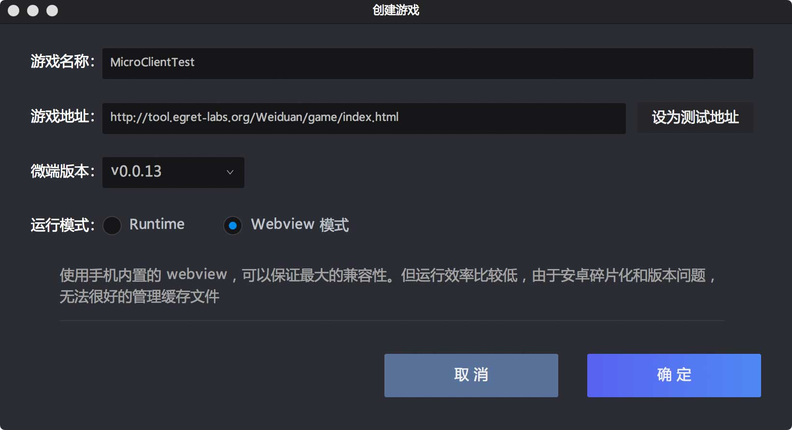
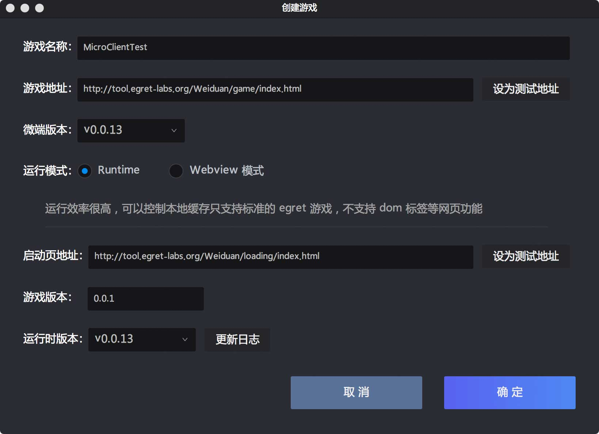
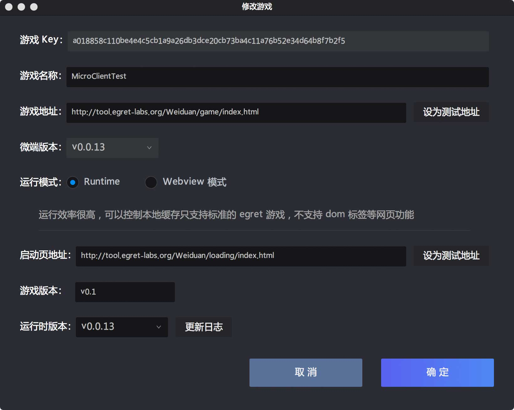
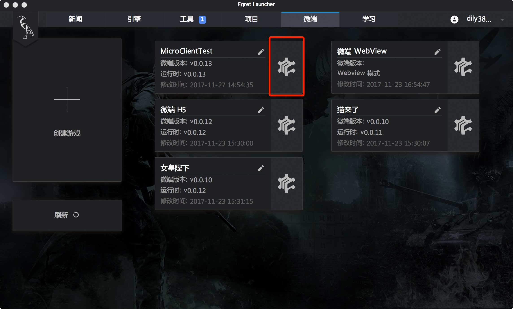
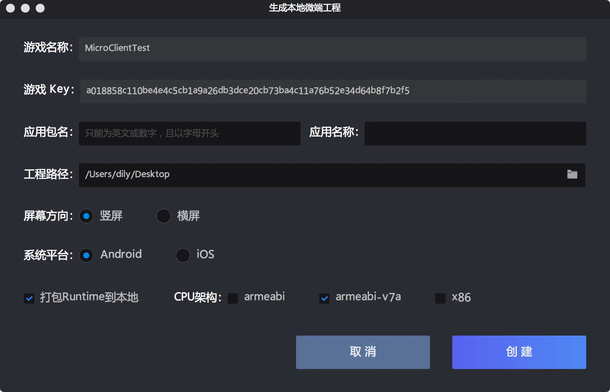

## 什么是微端

白鹭微端是 Egret 团队为了解决 HTML5 游戏打包为原生 APP 而发布的原生打包解决方案。通过白鹭微端解决方案，让 HTML5 游戏以真正原生 APP 形态展现在玩家手中。

白鹭微端内置两种运行模式，Runtime 模式下可大幅度提升基于 Egret 引擎所研发的游戏性能，而 Webview 模式可以最大化保证兼容性，支持其他不同游戏引擎所开发的 HTML5 游戏。与此同时，通过动态加载技术，白鹭微端可保证所打包的原生 APP 包体极小，以便节省游戏推广成本，提高游戏用户留存率。



上图为微端的工作架构图。

微端内包含两种运行模式：WebView 模式 和 Runtime 模式。根据游戏类型可以在微端管理后台任意切换。



玩家在打开一个微端游戏后，会从微端服务器获取 4 个信息（这些信息可以在开发者后台自行修改，后面会有详细的说明）。

1. 游戏的 URL 地址：这是微端里运行的 HTML5 游戏的真实地址。
2. 游戏的版本号：在 Runtime 模式下微端会把游戏过程中加载到的资源全部缓存下来。如果您修改了版本号，微端会自动清除本地缓存资源，重新下载。
3. Runtime 版本：Runtime 是用来运行游戏的播放器。如果开发者需要使用新功能或者遇到 bug 需要升级 Runtime，只要在后台设置一下，微端就会自动更新。**注意：** 由于 iOS 禁止热更新，远程更新 Runtime 的功能仅在安卓系统生效。iOS 需要通过更新安装包的方式实现更新。
4. 启动页 URL 地址：Runtime 的体积大概是 5MB 左右（不同机型体积不同，会自动适配），下载它的时候也需要一段时间，此时可以显示一个启动页，减少用户等待的焦虑感。这是一个标准的 HTML 页面，开发者可以自己设计，比如游戏的说明或广告，地址可以在管理后台设置。

上面这些工作完成了以后，就会全屏打开游戏页面，后面的流程和在浏览器中运行 Egret HTML5 游戏完全一致。

## 如何使用

我们可以通过登陆微端后台或者登陆 Launcher 创建一个游戏

* 微端后台地址：[https://cloud.egret.com/](https://cloud.egret.com/)  使用论坛的账号密码即可登陆。
* Launcher 下载地址：[https://egret.com/products/engine.html](https://egret.com/products/engine.html)  使用论坛的账号密码即可登陆。

下面以 Launcher 为例。

### 创建一个游戏

打开 Launcher 的微端页面，可以看到如下页面：



点击创建游戏即可看到如下页面，填写所需的参数，这些参数在创建好以后可以随时修改。



WebView 模式，只要填游戏名称和游戏地址就可以了。



Runtime 模式，可以设置更多的参数

1. **游戏名称：** 只是用于后台管理，可以和真实的游戏名不一致。
2. **游戏地址：** 微端运行的 HTML5 游戏地址。一般创建好了不需要修改，如果遇到服务器故障或被封等原因无法访问，可以修改成一个新的地址。**注意：** Runtime 模式目前仅支持 **4.1.0** 以上引擎制作的游戏。
3. **启动页地址：** 下载 Runtime 时显示的一个网页。**注意：** 这个页面会被缓存下来，如果修改了启动页的内容，请更换网页地址。
4. **游戏版本：** 第一个版本号。后期修改版本号后，微端会清除本地的缓存。

### 修改参数


创建好游戏以后，如上图所示可以在列表中看到，点击编辑图标



### 创建微端工程



点击如图所示的微端按钮，可以看到如下界面



输入相关参数，点击“创建”按钮，就会根据项目类型自动创建一个微端工程。Android 是一个标准的 Android Studio 项目，iOS 是 标准的 xcode 项目。

在工程项目里修改图标，接入第三方 SDK 以后就可以发布安装程序了。把发布出的安装包装到手机，就可以体验微端游戏了。

iOS 项目同上。

### 注意事项

1. 微端只支持 WebGL 模式，请确保 index.html 里的渲染模式
```
    egret.runEgret({ renderMode: "webgl", audioType: 0 });
```
2. 启动页会被缓存下来，如果要修改，请使用不同的 url 地址。
3. 微端仅支持 4.1.0 以上的 Egret 引擎制作的游戏。
4. 游戏地址的 HTML 页面里，不要使用 iframe 等 DOM 标签，否则可能无法解析。
5. 因为 iOS 访问 http 服务器需要打开 NSAllowsArbitraryLoads，为了能让游戏网页正常访问，我们的模板项目里是默认打开的。
6. 因为 iOS 禁止热更新，远程更新 Runtime 的功能仅在安卓系统生效。iOS 需要通过重新发包来实现更新。
7. RES 资源管理模块里有个设置最大并发加载线程数量的方法，在微端里建议改成 8，会提高加载速度。
```
    RES.setMaxLoadingThread(8);
```
8. Runtime 模式下，[js 与 Native 的交互方式请看此文档](http://developer.egret.com/cn/github/egret-docs/Native/native/communicateSkill/index.html), WebView 模式下的交互方式将在下个版本支持。
9. 如果游戏是横屏，请将微端工程也设置成横屏，否则会黑屏。
10. 安卓动态申请权限要求：如果在继承自 NativeActivity 的 Activity 中实现了 onRequestPermissionsResult 方法（模版中是 MainActivity），需要在方法中调用 super.onRequestPermissionsResult 。

### 相关下载和安卓版本要求
#### Egret Launcher

Launcher 下载地址：[https://egret.com/products/engine.html](https://egret.com/products/engine.html)  使用论坛的账号密码即可登陆。

#### 微端管理后台：[cloud.egret.com](http://cloud.egret.com)

[启动页 Demo 下载](http://tool.egret-labs.org/microclient/doc/zip/loadingPage_v4.1.zip)

#### 安卓版本要求：

Android 默认编译 SDK 版本：23（19 及以上都可以）

最低支持 SDK 版本：19

NDK 版本：r10d

gradle 版本：gradle-experimental:0.9.1

默认 buildToolsVersion：25.0.2


