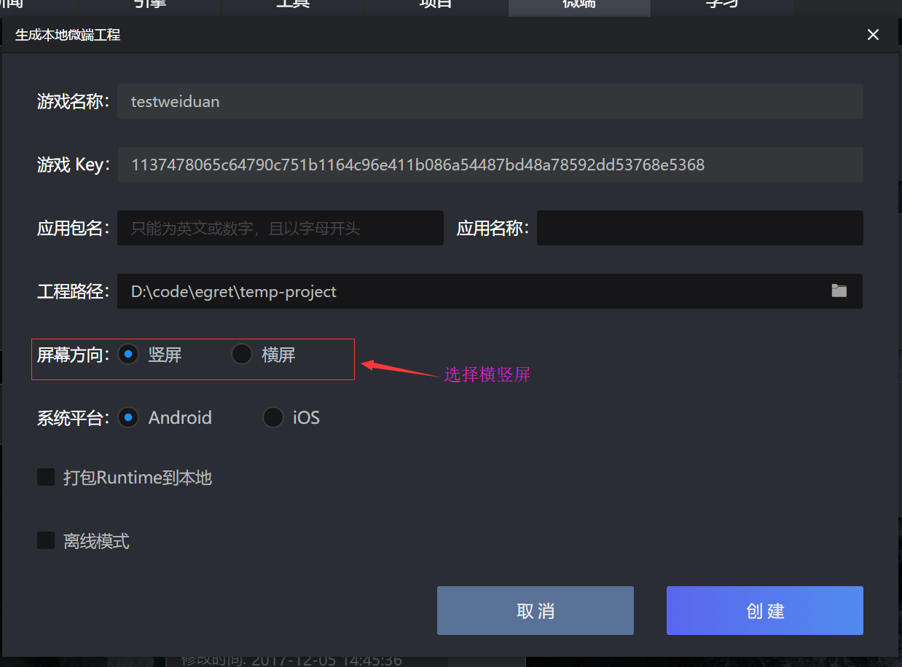
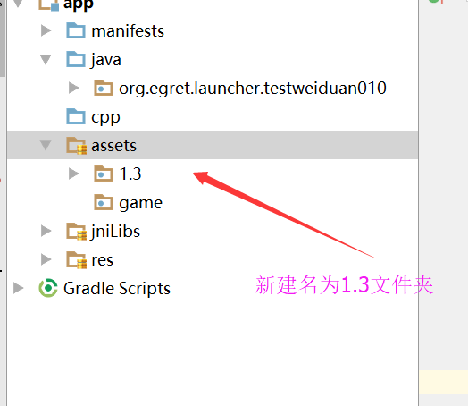
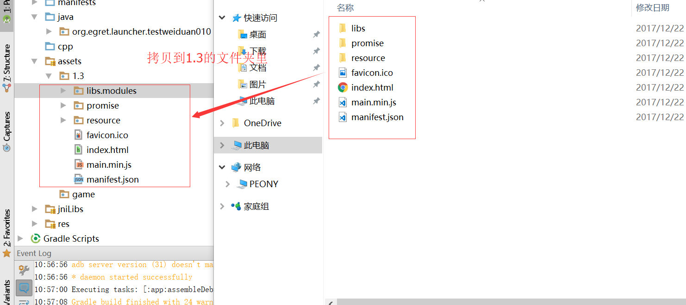

这里我们介绍一下如何使用微端来代替support打包。

### 先来对比一下使用上的区别和功能。

* 使用support的时候我们设置横竖屏需要更改项目的xml文件，其实是很不方便的，我们在使用微端的时候只需要在生成微端项目时勾选横竖屏即可，如图：

* 后续将会支持热更新，目前只能用户重新生成apk的形式进行更新。

* 调试方式和support的调试方式是一样的，都是ide调试使用的方式。

* 通讯方式基本上是一样的，参考‘微端中JS和Java之间通信方法’这一节，这里有我们已经写好了[demo](http://developer.egret.com/cn/github/egret-docs/microclient/manual/jstonative/index.html)供您参考。

### 如何将我们的H5游戏打包到本地呢

* 先打开我们微端项目生成的文件夹（不知道如何生成微端项目同学请参考下白鹭微端使用说明）记住生成游戏的版本，如忘记可以在egret Launcher中查看，并找到assets文件如果没有请您自己手动创建一个，然后在这个文件夹下新建一个与游戏版本对应的文件夹，例如我的游戏版本是1.3，所以我要新建一个名为1.3的文件夹。如图：

* 将我们已经发布好的H5项目拷贝到名为1.3这个文件夹即可，注意要使用 egret publish发布出来的项目，如图：

* 接下来我们就可以使用android stodio来打包发布这个项目了。