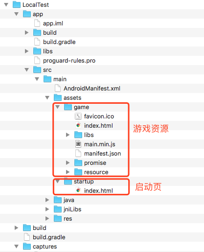

## 使用本地资源的方法

使用本地资源需要将相应的资源添加在assets目录下

assets目录的结构如下：

	+assets
		+game
			-index.html
			......
		+libs
			+armeabi
				-libegret.so.zip
			+armeabi-v7a
				-libegret.so.zip
			+x86
				-libegret.so.zip
			-egret-dex.jar
		+startup
			-index.html
			......
		
游戏放在“game”文件夹下，index.html需要在“game”的下一级。

启动页放在“startup”下，index.html需要在“startup”的下一级。

上图为一个示例工程的结构图

然后在微端管理后台修改参数：如果游戏资源在本地，游戏地址填`local`。如果启动页地址在本地，启动页地址填`local`。

如果上线后需要更新的时候，只要在后台修改成需要的游戏地址，游戏端就会更新游戏，覆盖本地的版本。修改了启动页地址，游戏端就会更新成新的启动页。