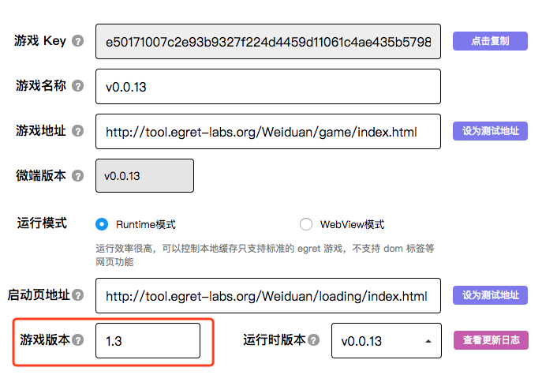
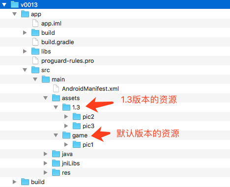
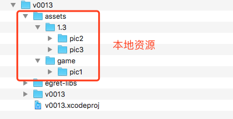

## 使用本地资源的方法
微端使用的资源默认从网络加载，从 v0.0.13 版本开始，可以将资源打包在 app 中，并且进行版本控制。

### 1.后台设置

首先在微端后台设置 **游戏版本**，比如我们设置为：1.3

### 2.安卓工程设置

使用本地资源需要将相应的资源添加在 assets 目录下

如上图所示，在 assets 目录下有 1.3 和 game 两个文件夹。
1.3 是指版本号为 1.3 时本地资源的目录。
game 是指使用任意版本号时本地资源的目录。

举例说明一下。

当游戏需要加载 pic2/a.png 这个图片时，因为微端后台设置了版本号1.3，所以首先会查找 1.3 这个目录下是否有这个图片，如果没有再查找 game 目录下是否有，如果没有再判断是否从网络下载过，如果还没有再从网络加载。

如果微端后台版本号改成了1.4，那么游戏启动后会先查找 1.4 这个目录下是否有资源，后续逻辑同上。

总结一下，资源的查找逻辑为：版本号文件夹=》game文件夹=》下载的资源=》从网络加载

通过这种方式，可以灵活的控制游戏 app 使用包体内的资源还是使用网络资源。

### 3.iOS工程设置

iOS 工程的设置如上图所示，加载逻辑和安卓相同