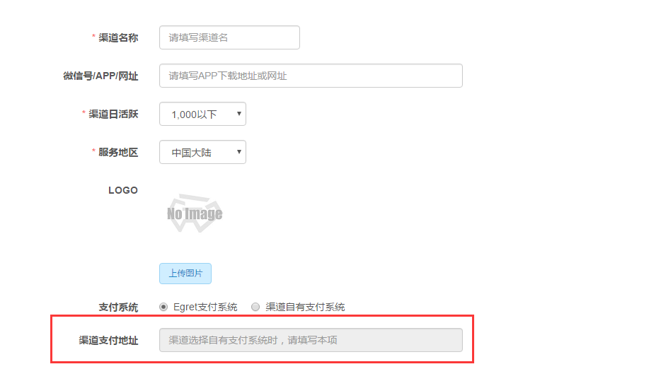
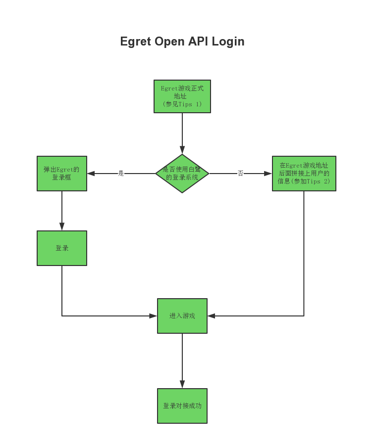
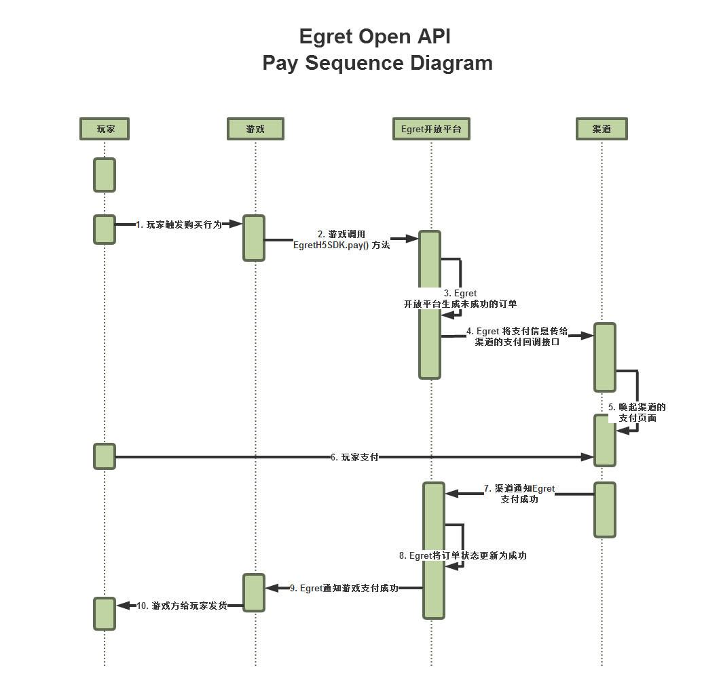
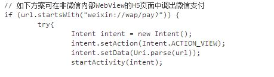

[一、前期工作](#一、前期工作)

[二、接口](#二、接口)
[1.登录接口](#1.登录接口)
[2.支付接口](#2.支付接口)
[3.Egret接收支付结果接口(支付回调)](#3.Egret接收支付结果接口（支付回调）)

[三、附录](#三、附录)
[附录一：签名生成规则](#附录一：签名生成规则)
[附录二：状态码（code）对照表](#附录二：状态码（code）对照表)
[附录三：APP接入白鹭支付](#附录三：APP接入白鹭支付)

## 一、前期工作

### 1.	登录Egret开放平台 （[http://open.egret.com](http://open.egret.com) ）:

获取对接所需要的appId , appKey (appId即为渠道Id)；
获取游戏的正式地址和游戏的支付回调地址

### 2.	如果渠道使用自己支付系统， 请准备一个支付回调的接口，填在Egret开放平台上


## 二、接口

如果渠道使用自己的登录系统，则要确保接口1接通，否则使用Egret的登录系统；
如果渠道使用自己的支付系统，则要确保接口2的两个接口接通，否则会影响游戏充值。

### 1.登录接口

1.1 登录流程图




#### Tips:


- Egret游戏正式地址登录白鹭开放平台(http://open.egret.com)，按照下面的路径可以拿到：渠道商 -> 渠道 -> 游戏中心 -> 已上架游戏 -> 游戏详情。
形如： http://api.egret-labs.org/v2/game/[chanId]/[gameId]， [] 表示其在白鹭开放平台上的对应id。

	例: 假如您在白鹭开放平台上注册的渠道Id是12345，您要上线的游戏的Id是88888，则该游戏的游戏地址为： [http://api.egret-labs.org/v2/game/12345/88888](http://api.egret-labs.org/v2/game/12345/88888)


- 渠道方若想使用自己的用户体系登录游戏，只需要在Egret游戏地址后面，拼接上渠道方的用户信息即可。

	例: 假如在渠道的用户体系内有一个用户信息如下，

	用户id：54321， 
	用户昵称：张三， 
	用户头像：http://img.baidu.com/54321.jpg，
	玩家性别：男。 
	
	只需要把用户的信息用GET方式请求 Tips 1中的Egret游戏地址即可, 如下：

	http://api.egret-labs.org/v2/game/12345/88888?userId=54321&userName=张三&userSex=1&userImg=http%3a%2f%2fimg.baidu.com%2f54321.jpg&channelExt=&time=1470109186&sign=0ca175b9c0f726a831d895e269332461。
	其中，userImg 参数值要urlencode, userSex参数值 1表示男，2表示女，0表示未知

1.2 接口地址：

白鹭开放平台上获取的游戏正式地址

例： [http://api.egret-labs.org/v2/game/12345/88888](http://api.egret-labs.org/v2/game/12345/88888)

对应的游戏地址，登录http://open.egret.com, 渠道商->渠道管理->《你们的渠道名字》->游戏中心->已上架游戏， 点击对应游戏的 《游戏详情》

1.3 传参方式：

GET

1.4 参数说明：

| 参数名 | 必传 | 参数描述 |
| ------------ | ------------- | ------------ |
| userId | 是 | 玩家在渠道上的用户id |
| userName | 是 | 玩家在渠道上的用户昵称 |
| userImg | 是 | 玩家在渠道上的头像，没有则传空字符串，传参之前，请将地址进行urlencode |
| userSex | 是 | 玩家在渠道上的性别：1表示男，2表示女，0表示未定义 |
| channelExt | 否 | 渠道透传的参数，此参数在用户支付时会原样回传给渠道的支付页面 |
| time | 是 | Unix时间戳（精确到秒） |
| sign | 是 | 验证签名，该接口签名方式：md5(“appId=[appId]time=[time]userId=[userId][appKey]”); [appId]代表appId的值， appId, appKey有Egret开放平台提供 （appId即为Egret开放平台上的渠道id），sign 值应是数字和小写字母组成的字符串 |


请求样例：
http://api.egret-labs.org/v2/game/12345/88888?userId=54321&userName=张三&userSex=1&userImg=http%3a%2f%2fimg.baidu.com%2f54321.jpg&channelExt=&time=1470109186&sign=0ca175b9c0f726a831d895e269332461。

1.5 返回结果：
 可以进入游戏，即表示接入成功

### 2.支付接口
以下为白鹭开放平台支付时序图，和渠道相关的只有第4步和第7步。


步骤：

- 玩家在游戏中触发购买行为
- 游戏调用EgretH5SDK.pay() 方法
- Egret开放平台生成未成功状态的订单
- Egret将支付信息传给渠道的支付回调地址接口(拉起渠道的支付页面)
- 唤起渠道的支付页面
- 玩家支付
- 渠道通知Egret支付成功
- Egret将订单状态更新为成功
- Egret通知游戏支付成功
- 游戏方给玩家发放道具

2.1 接口地址：
由渠道提供的支付页面地址 (需要渠道方在open.egret.com上提交)

2.2 请求方式：
POST

2.3 参数说明

| 参数名 | 必传 | 参数描述 |
| ------------ | ------------- | ------------ |
| userId | 是 | 玩家在渠道上的用户id |
| userName | 是 | 玩家在渠道上的用户昵称 |
| gameId | 是 | 游戏Id |
| goodsId | 是 | 游戏商品Id |
| goodsName | 是 | 游戏商品名称 |
| money | 是 | 支付金额(大陆地区统一为人民币元 float类型) |
| egretOrderId | 是 | egret的订单Id |
| channelExt | 否 | 渠道在用户登录进入游戏时的透传参数，在此原样回传给渠道 |
| ext | 是 | 此参数为透传参数，通知支付结果接口调用的时候原因返回给Egret |
| gameUrl | 是 | 游戏地址，渠道完成支付流程后，跳转回游戏的地址 |
| time | 是 | Unix时间戳（精确到秒） |
| sign | 是 | 验证签名， 该接口签名方式：md5(“appId=[appId]egretOrderId=[egretOrderId]gameId=[gameId]goodsId=[goodsId]money=[money]time=[time]userId=[userId][appKey]”); appId、appKey由Egret开放平台提供。(appId即为渠道在Egret开放平台上的渠道Id， money不能小于1)， sign 值应是数字和小写字母组成的字符串 |

2.4 返回结果
能拉起渠道的支付页面即为表示对接成功

### 3.Egret接收支付结果接口（支付回调）
3.1 接口地址：
白鹭开放平台上获取游戏支付回调地址.
例：[http://api.egret-labs.org/v2/pay/12345/88888](http://api.egret-labs.org/v2/pay/12345/88888)

对应的支付回调地址，登录[http://open.egret.com](http://open.egret.com), 渠道商->渠道管理->*《你们的渠道名字》*->游戏中心->已上架游戏， 点击对应游戏的 《游戏详情》

3.2 请求方式：
POST

3.3 参数说明：

| 参数名 | 必传 | 参数描述 |
| ------------ | ------------- | ------------ |
| orderId | 是 | 渠道订单id |
| userId | 是 | 玩家在渠道的用户Id |
| money | 是 | 玩家在渠道上的充值金额，如果渠道有自己的代金券，或者折扣，应该传用代金券或者打折之前的金额（大陆统一为人民币元，float类型） |
| ext | 是 | Egret透传参数，此参数在调用渠道支付页面地址时传给渠道，在此需原样回传给Egret |
| time | 是 | Unix时间戳（精确到秒） |
| sign | 是 | 验证签名（签名生成方式相见附录1） |

3.4 返回结果：

返回格式： json
返回数据字段：

| 字段名 | 字段描述 | 示例 | 备注 |
| ------------ | ------------- | ------------ | ------------ |
| code | 状态码 | 0 | 0为成功，其他表示错误（[code对应关系，见附录二](#附录二：状态码（code）对照表)） |
| msg | code对应消息 | success | 字符串类型 |
| data | 数据 | [] | 请求正常是，此字段为空数组 |

返回样例：

```
{
  "code":0,
  "msg":"success",
  "data":[]
}
```

## 三、附录

#### 附录一：签名生成规则

签名生成规则：

1. 对参与签名的参数的键值进行正序排列
2. 生成待加密字符串
   * 第一步：对排好序的参与签名加密的参数按照排序顺序以 key1=value1key2=value2...keyn=valuen 形式连接成字符串
   * 第二步：在已经连接好的字符串尾部连接appkey(appkey在开放平台获取) ，最终形成的待加密字符串格式为key1=value1key2=value2...keyn=valuenappkey
3. 对待加密字符串进行md5加密

生成签名方法php代码样例:

```
function createSign($params, $appkey){
		isset($params['sign']) && unset($params['sign']);
    	isset($params['page']) && unset($params['page']);
    	isset($params['per']) && unset($params['per']);
		ksort($params);
		$str  = "";
		foreach($params as $key=>$value){
			$str  .=  $key ."=". $value;
		}
		return md5($str.$appkey);
```

附签名检测工具：[http://open.egret.com/checkSign](http://open.egret.com/checkSign)

#### 附录二：状态码（code）对照表

| code | 对应含义 |
| :------------: | :------------- |
| 0 | 成功 |
| 1001 | 参数不全 |
| 1006 | sign 错误，验证通不过 |
| 1009 | 重复订单 |
| 1013 | 支付失败 |

#### 附录三：APP接入白鹭支付
注意：本节只适用于有自己App的CPS渠道(使用白鹭支付的渠道)

因白鹭支付内集成微信支付，如在App内使用微信H5支付，需对url单独处理

参考链接： [http://blog.csdn.net/ahence/article/details/51317814](http://blog.csdn.net/ahence/article/details/51317814)



