新版的游戏上线流程如下：

完善资料 --> 游戏初审 --> 先行测试 --> 上线

 

1、注册Egret账号，用注册的账号登陆Egret开放平台(http://open.egret.com/)

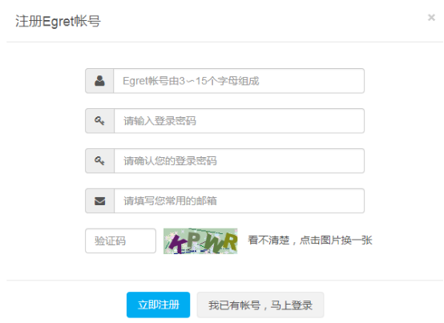

2、开始创建游戏

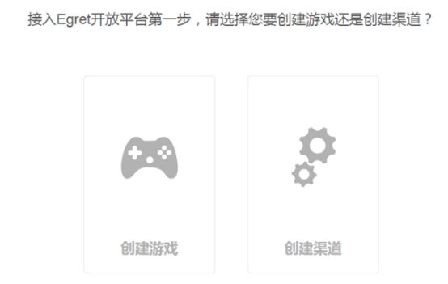

3、完善游戏基本资料后点【创建】

 

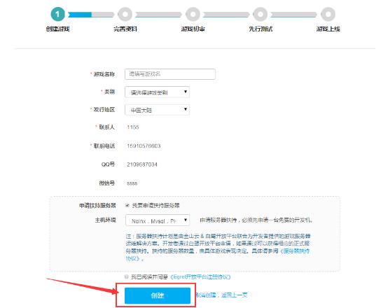

 

4、创建成功后，根据页面主流程图的提示，完成各资料的填写

 

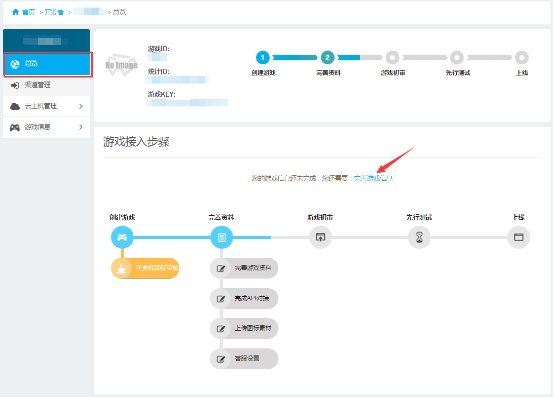

 

5、四项内容都填写完整后，可以提交初审。

5.1【关于初审】

初审过程，是游戏测试和上线之前的必备流程，您可以在此阶段优化游戏。

我们提供专业的运营团队，根据精细的评级指标来为您的游戏评级，并会向您出具一份该游戏的初审报告。您可以根据报告中的评分和级别，来针对性的调优游戏各项内容。

 

5.2【指标评分】

评级指标包括如下内容：

IP题材

影音品质--界面UI、角色、美术风格、特效动画、音乐音效、场景

核心玩法--核心玩法、系统丰富、社交性、上手度

商业化--首次付费、养成空间、付费引导

产品技术--稳定性、流畅度

加分项--评委加分

以上的每一小项都会由6-9位评审人员逐一打分，算出每项的平均分。

 

5.3【游戏评级】

根据各指标分，最终得到游戏的评级，级别由高到低分为：S级，A+级，A级，B+级，B级，C级，D级

开放平台会在后续更新中，为不同级别的游戏，提供不同档次的扶持服务。因此，如果您获得较低的游戏级别后，可以选择调优游戏，并再次申请初审，以便获得更高的评级和更丰富的服务内容。

 

5.4【初审时间】

初审的时间如下：

每周一，运营人员统一开始对上一周的所有提审游戏进行初审。经过各人评分和开会集中讨论，最晚会在每周五将初审报告反馈给开发者。

每个游戏按照上一周提交的时间来顺序处理。

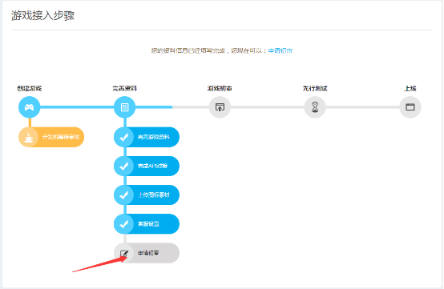
 

6、申请后需要等待至下周一，开始初审

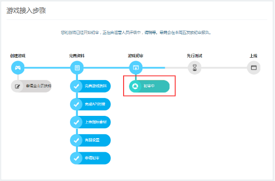

 

7、游戏初审通过，会弹出初审报告

 

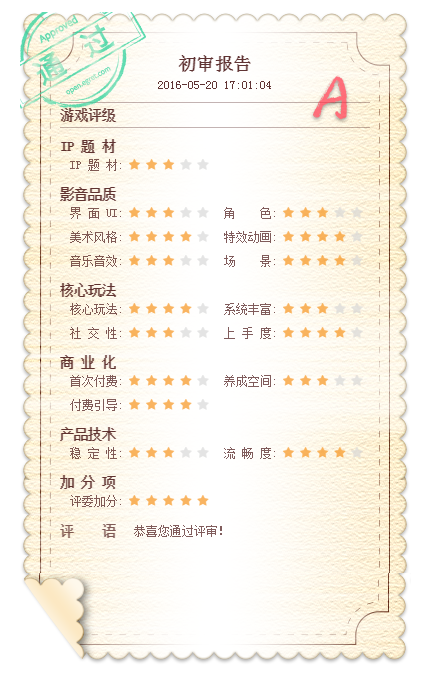

 

8、此时您可以开始申请先行测试

 

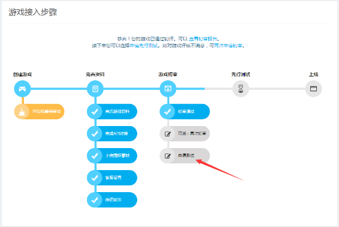
 

9、申请后也会进入等待队列，队列的位置会实时更新

 

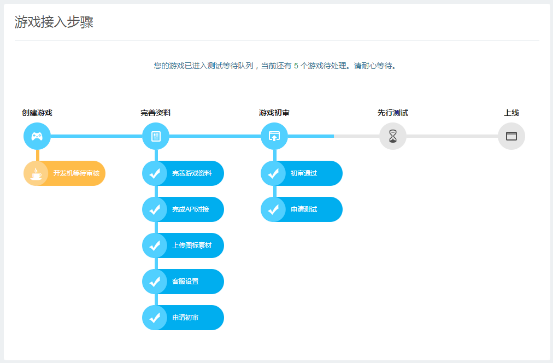
 

 

10、运营人员做好先行测试检测工作并为您安排测试渠道后，您的游戏开始进入测试

 

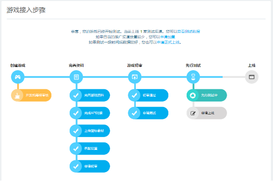
 

 

11、测试一段时间后，可以申请上线

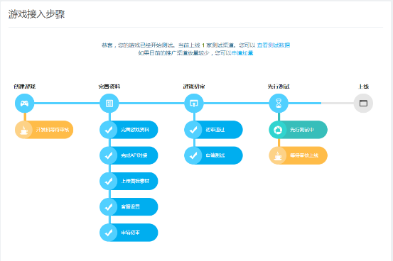
 

 

12、通过后即可正式上线。

