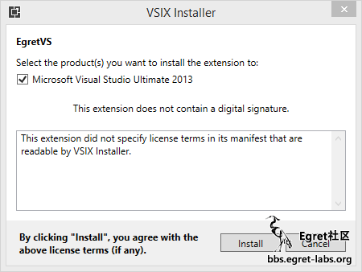
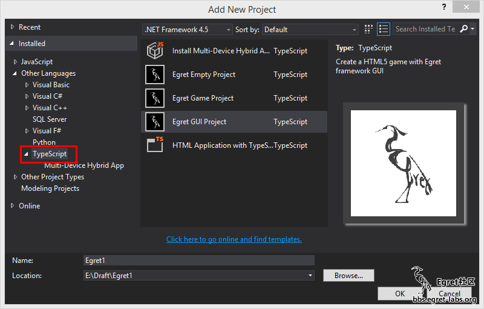
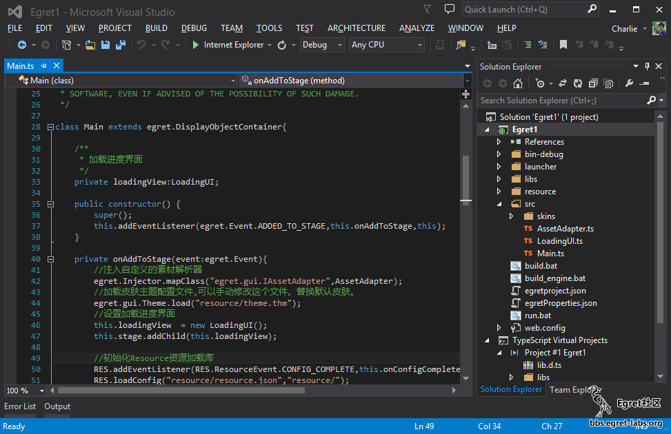
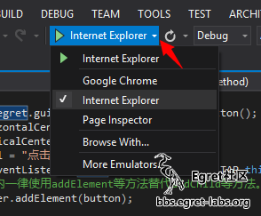
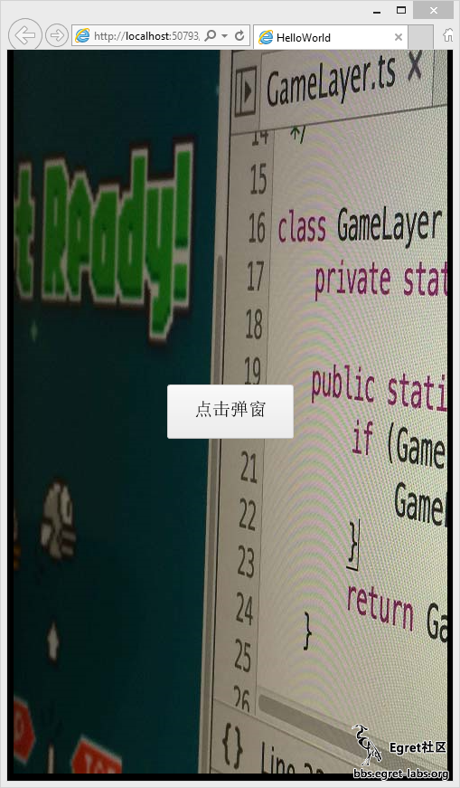
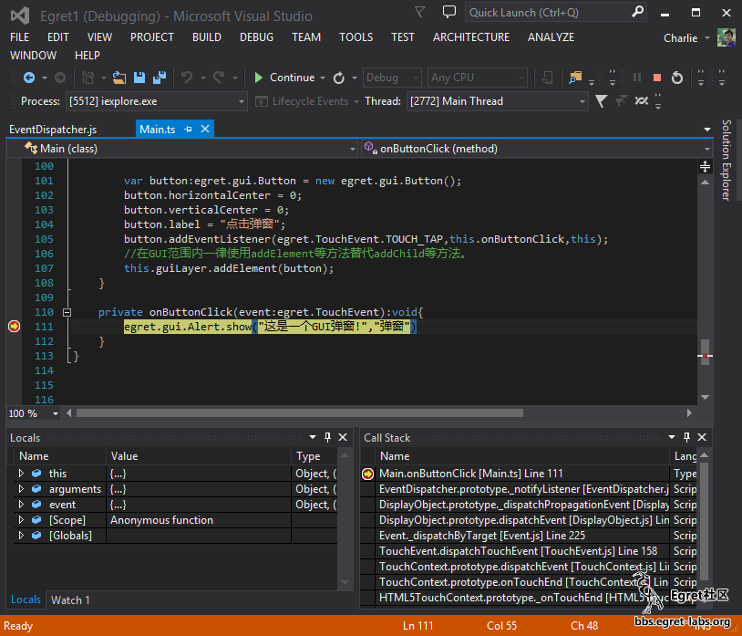
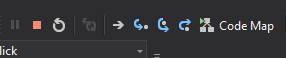
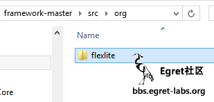
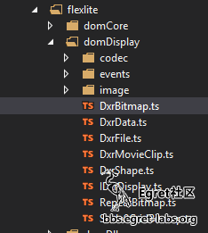

## 简介
EgretVS是为Egret Framework用户开发的一款Visual Studio插件，使VS用户可以方便的创建调试Egret项目，借助VS强大的TypeScript支持获得良好的Egret开发体验。

#### 下载地址

* [点击进入官方下载地址](http://www.egret.com/products/others.html)

## 安装
#### 安装环境

[Visual Studio 2012 + TypeScript Tools](https://visualstudiogallery.msdn.microsoft.com/2d42d8dc-e085-45eb-a30b-3f7d50d55304)

Visual Studio 2013 Update 3+


#### 安装方法
双击EgretVS.vsix选择需要安装的VS版本安装。
使用IE下载的开发者： 如果你下载到的文件是 EgretVS-v.版本号.zip 而不是 vsix，请手动修改扩展名为vsix,或使用其他浏览器下载，谢谢。






#### 创建项目

EgretVS中包含了三种Egret项目模板，您可以根据需要选择要创建的项目
在新建项目窗口中左侧依次选择“其他语言>TypeScript”，就能看到三种Egret项目模板




三个模板分别为

* Egret Empty Project：
    空的Egret项目，只包含基本的类库，没有示例代码
* Egret Game Project：
    Egret 游戏示例项目，包含基本类库和示例代码
* Egret GUI Project：
    Egret GUI项目，包含基本类库和egret.gui类库，并包含gui示例代码

本文中选择GUI项目，点击OK创建项目。
项目创建完成后EgretVS会默认打开Main.ts文件。





#### 项目编译
直接使用VS的编译命令来编译Egret项目




同时EgretVS提供了一个菜单来实现Egret项目特有的编译参数




三个命令分别为

* Build：
编译项目ts文件
* Build Engine：
编译Egret Engine到本地目录，这个命令一般用于修改了egretProperties.json中的modules或其他需要重新编译引擎代码的情形
* Publish Game：
发布Egret项目，这个命令会打包压缩所有的ts 和 js文件实现最小的网络传输



#### 项目发布
右击需要发布的项目，点击Egret > Publish Game


 

发布完成后会自动打开发布后的文件夹




#### 项目调试VS集成调试
借助VS自带的TS调试功能我们能够很方便的调试我们的TS代码
在TS编辑器左侧添加一个断点




> 选择Internet Explore作为调试浏览器（VS只能够附加到IE中实现JS调试功能）





点击绿色箭头（或按F5）开始调试




点击按钮，会看到断点被激活。




我们可以在下方的窗口中看到局部变量和调用栈





使用相关按钮或快捷键即可进行单步调试





#### 其他浏览器调试
在解决方案资源管理器中找到
Launcher\index.html，右击鼠标选择“在浏览器中查看”




浏览器窗口弹出后你就可以在熟悉的浏览器中调试了。








#### ActionScript转TypeScript
EgretVS提供了ActionScript到TypeScript的转换功能，使您可以方便的倒入现有AS项目。

先创建一个Egret项目，然后在电脑中打开现有AS项目的目录，选择需要转换的文件或文件夹，复制。




在VS的解决方案资源管理器中选择放置代码的目录（本文中选择的是src目录）右击粘贴或Ctrl-V




根据转换文件的数量，转换的时间会有所不同，转换完成后就能看到转换之后的ts代码




转换之后的TS文件中可能会有一些语法错误，您可能需要自己修复编译时发生的错误。



