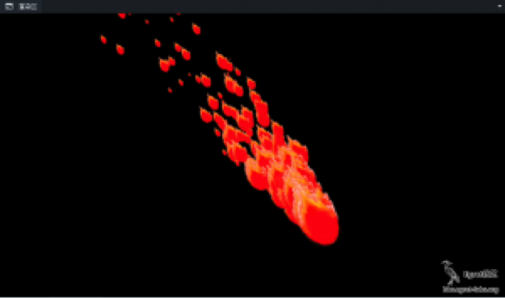

## 简介
Egret Feather是一款粒子效果编辑器，全程可视化编辑操作，屏蔽所有底层复杂的参数设置。所见即所得的操作模式，让即使毫无编程技能的美术人员也可快速上手，立即制作出精美的粒子效果。编辑器自动导出配置文件供程序开发使用，让游戏效果更加绚丽！

#### 适应平台

* Windows

* Mac OS X


#### 适应版本

* 1.2.0 版本以及以上

#### 下载地址

* [点击进入官方下载地址](http://www.egret.com/downloads/feather.html)

## 主界面


主界面上包含了几个面板，分别是：

* 纹理面板
* 颜色面板
* 动作属性面板
* 基本属性面板
* 可视操作面板
* 渲染区面板。

接下来我们逐个介绍这些面板。


#### 纹理面板




这里显示的是渲染用的纹理，可以点击或者拖拽纹理到这里来更换纹理



#### 颜色面板



颜色面板分为两部分，开始颜色和结束颜色，一个粒子开始到结束，颜色也会发生过渡变化，目前引擎支持透明度，所以这里就不开放RGB颜色的设置啦。


#### 动作属性面板



哈，这个面板是粒子行为方式的关键所在啦，里面用到了物理知识，大家要是想了解具体定义和公式的话，就去网上搜索下吧。重力模式可以用来做一些类似火焰、雨雪等等等的效果。用过其它粒子编辑器的童鞋还会想到半径模式，egret引擎还在茁壮成长中，暂且不能应用半径模式，所以这里也就不开放半径模式啦。


#### 基本属性



这里是有关粒子最基本的一些属性，比如 粒子生、发射的粒子数量、旋转角度等等。着重说明一下 “发射时长”这个参数，这个参数的值如果是正数的话，那么粒子发射器发射指定时长后将会停止发射，如果是负数的话（无论负值是多少），那么粒子发射器会一直发射。


#### 可视调节面板



可视调节面板是将部分零散的属性进行了整合。童鞋们可以在面板中通过鼠标操作来更改一组属性，十分方便快捷。


#### 渲染区面板



这个面板就是呈现效果的面板啦。所有属性带来的变化都会展现在这里。这里藏着一个小功能，按住Ctrl键在面板中点击可以将发射原点定位到指定位置。



默认情况下都是左上角，为了方便童鞋们观看效果，so..加了这个小功能。


## 预置效果
此工具预置了两个模板效果：




这个效果都是重力模式的效果（其实 重力模式 就可以实现好多种效果了）


## 小结

粒子效果可以为游戏锦上添花，但是使用频率和粒子数量上也要有个度，单个效果的粒子数量最好不要超过200个，太多话会掉帧的。

