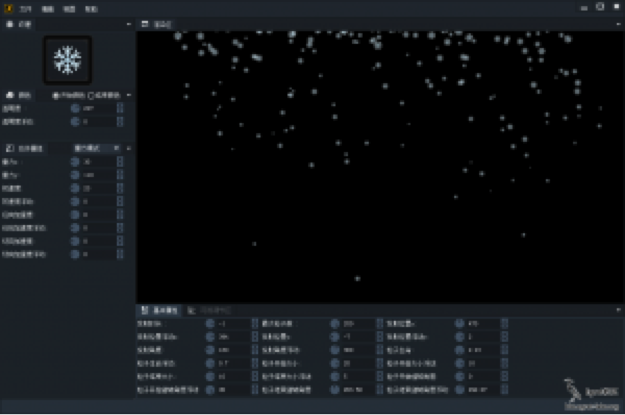
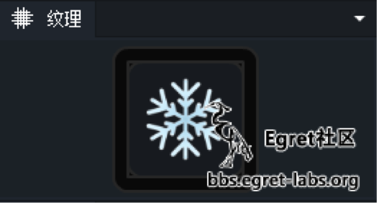
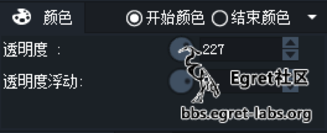
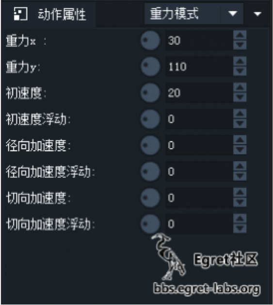
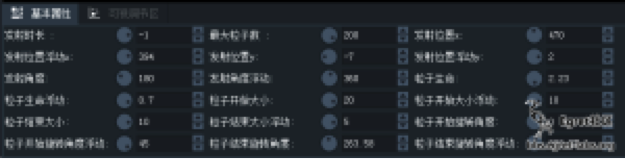
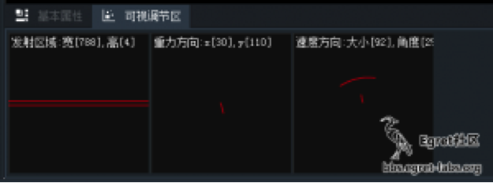
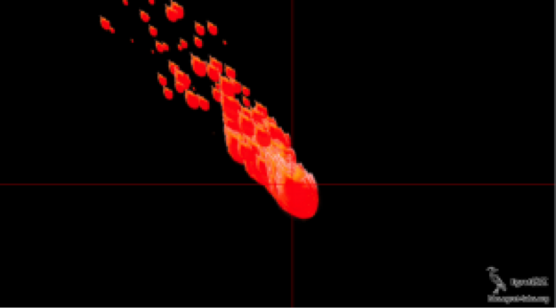
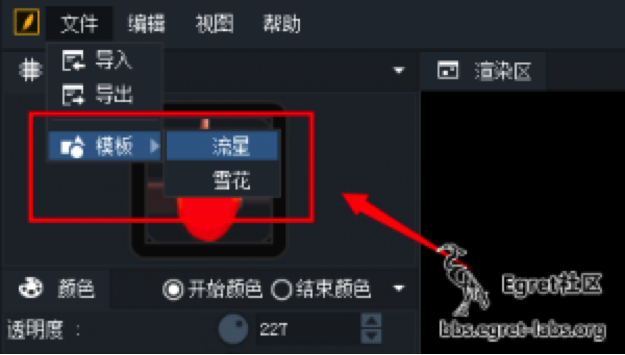

## 简介

Egret Feather是一款粒子效果编辑器，全程可视化编辑操作，屏蔽所有底层复杂的参数设置。所见即所得的操作模式，让即使毫无编程技能的美术人员也可快速上手，立即制作出精美的粒子效果。编辑器自动导出配置文件供程序开发使用，让游戏效果更加绚丽！

### 适应平台

* Windows
* Mac OS X


### 适应版本

* Egret Engine 1.2.0 版本以及以上

### 下载地址

* [Egret Feather 下载地址](http://www.egret.com/downloads/feather.html)

## 主界面


主界面上包含了几个面板，分别是：

* 纹理面板
* 颜色面板
* 动作属性面板
* 基本属性面板
* 可视操作面板
* 渲染区面板。

### 纹理面板



此处显示当前渲染纹理，可以点击或者拖拽纹理到图标中更换纹理。

### 颜色面板



颜色面板分为两部分，开始颜色和结束颜色，一个粒子开始到结束，颜色也会发生过渡变化。

### 动作属性面板



粒子行为方式设定，重力模式可以用来做一些类似火焰、雨雪等等等的效果。

### 基本属性



粒子基本属性，如：粒子生成、发射的粒子数量、旋转角度等。“发射时长”参数，其值如果是正数，粒子发射器发射指定时长后会停止发射，如果是负数的话，那么粒子发射器会一直发射。


### 可视调节面板



可视调节面板是将部分零散的属性进行了整合。可以在面板中通过鼠标操作来更改一组属性，十分方便快捷。

### 渲染区面板



实时预览界面。所有属性变化会在此面板实时渲染，按住Ctrl/command键在面板中点击可以将发射原点定位到指定位置。



## 预置效果

Egret Feather 预置了两个模板效果：



两个效果为重力模式的效果。