首先用chrome打开需要调试的项目。并打开Egret工具。

鼠标点击游戏场景中的元素，该元素在场景中会被高亮显示，同时Inspector中会显示当前场景中的显示列表树。

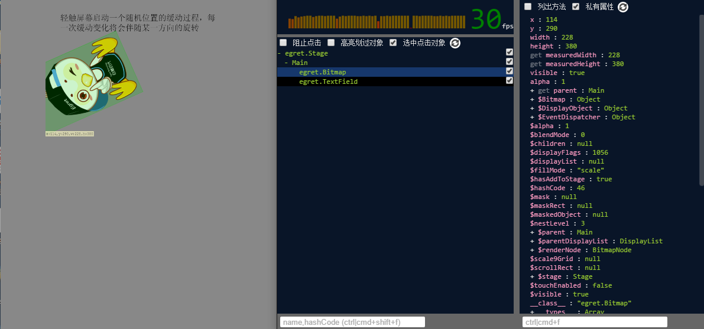

### FPS显示

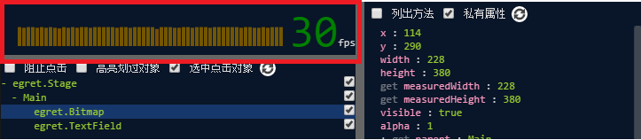

### 显示列表面板

* 阻止点击事件

当想要检查按钮等点击之后会消失的对象，请勾选“阻止点击动作”选项再进行检查操作。

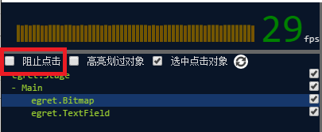

* 显示鼠标划过的对象

勾选显示列表面板中的“高亮划过对象”选项，然后当鼠标在场景中移动时就会高亮显示鼠标滑过的对象

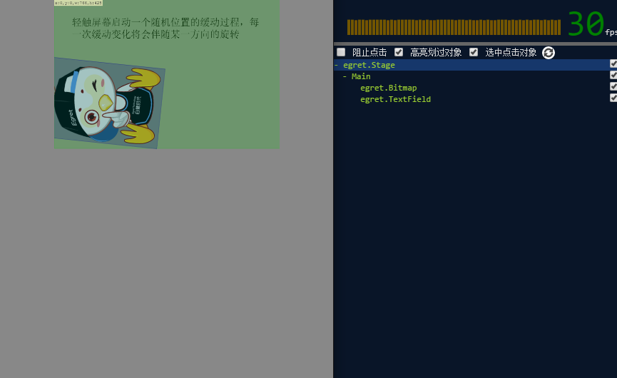

* 选中点击对象

高亮显示鼠标点击对象，并在属性面板中显示该对象的属性。取消改选项时，将不再跟踪鼠标点击动作

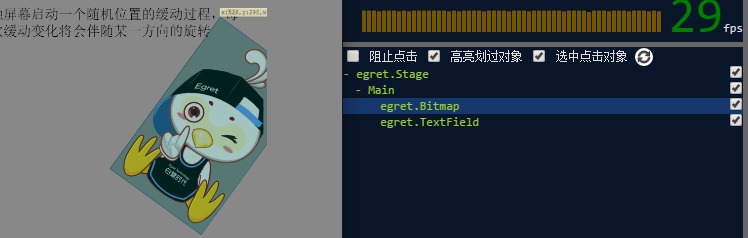

* 刷新按钮

由于在游戏中显示列表树变化频繁，所以Inspector中的显示列表树并不是实时更新的，而是当鼠标点击对象时更新。当你长时间没有点击时，显示列表树可能会与场景中的结构由很大差异导致不能自动更新，这时可以点击刷新按钮开重新加载显示列表树。

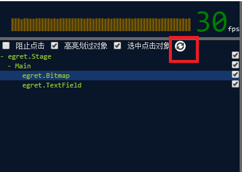

* 展开显示列表

在现实列表树中显示对象前方带有 + 号的对象表明含有子元素，可以点击展开。显示对象后面的选框是快速隐藏或者显示该对象的开关方便查看被遮盖的对象

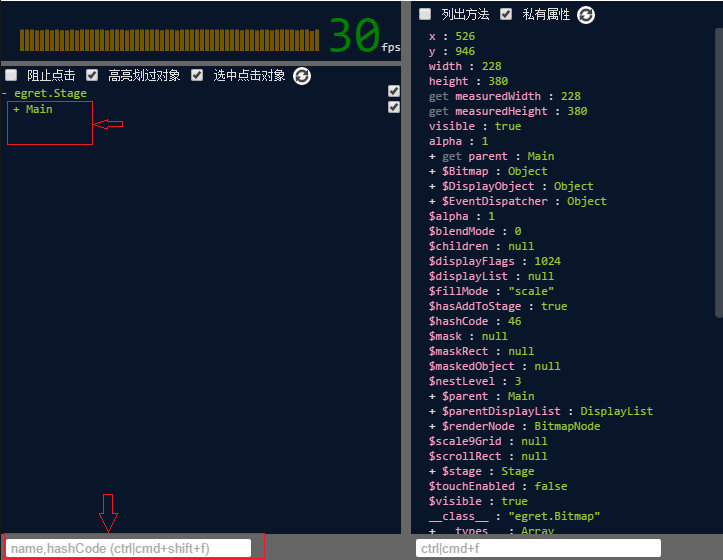

* 搜索在现实列表树下方的搜索框中（快捷键Ctrl/Command + Shift + F）输入 显示对象name或hashCode来搜索

* 存储全局对象
右击显示列表中的对象，点击存储为全局变量，在控制台中将会输出全局变量名和该对象

### 属性面板

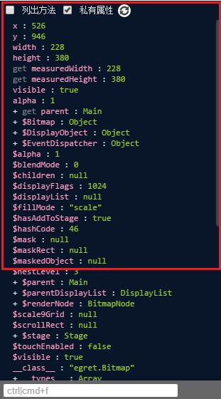

* 选项开关

	* 列出方法：
在属性列表中显示方法，鼠标经过时会显示方法的内容

	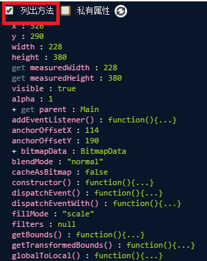

	* 列出私有属性：
选择是否显示以下划线或$开头的属性，并非TS 的private

	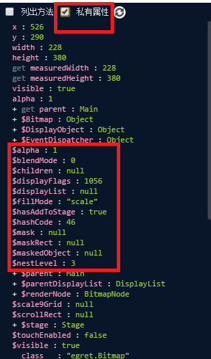

* 属性编辑
	双击属性值，即可编辑属性，回车或者离开输入框提交更改

	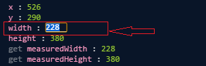

	对于只提供Getter没有Setter方法的属性，不能编辑
	
	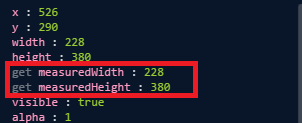

* 搜索在属性列表下方的搜索框中（快捷键Ctrl/Command + F）输入字符来搜索属性或属性值

* 存储全局对象
右击属性列表中的项目，点击存储为全局变量，在控制台中将会输出全局变量名和该对象