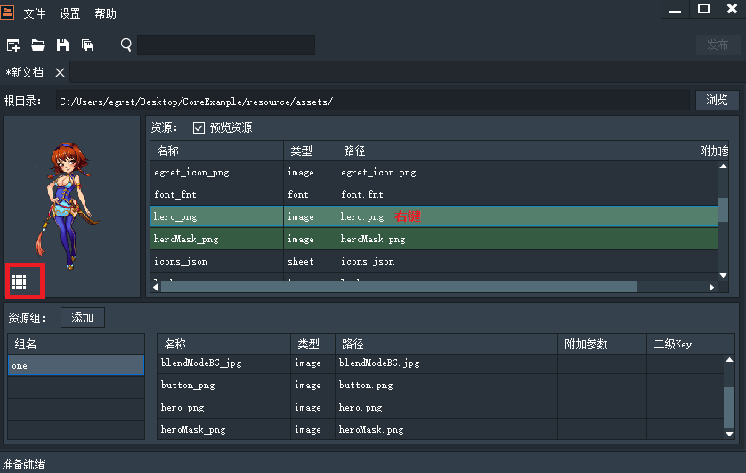
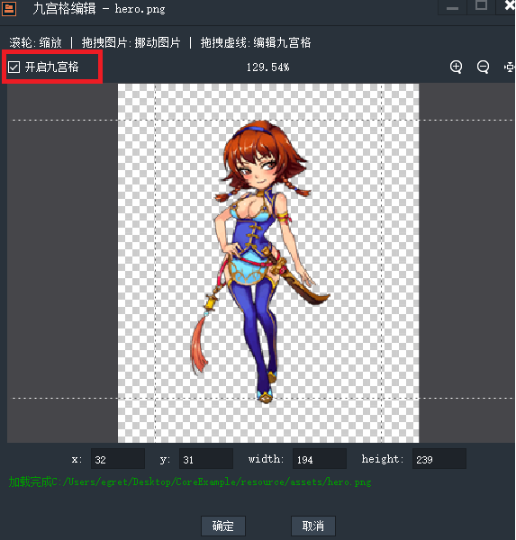
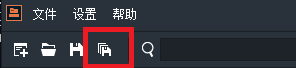

进入编辑九宫格界面有如下两种方式，点击红框处九宫格图标，或者右键图片资源。

如果想编辑九宫格，首先应该勾选左上角的“开启九宫格”复选框。具体对于九宫格的编辑方式如下：

* 鼠标滚轮：缩放
* 拖拽图片：移动图片
* 拖拽虚线：编辑九宫格

可以手动编辑，之后点击确定，可以看到图片的附加参数有了九宫格数据，如下所示。

点击全部保存，将配置好的文件保存，起名为example。可以看到保存好的json文件。

