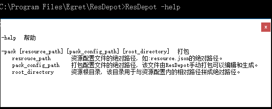
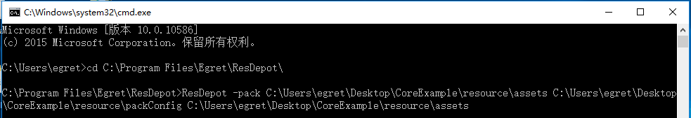

#### 命令

* -help 该命令会使ResDepot弹出帮助界面

* -pack [resource_path] [pack_config_path] [root_directory] 打包
    * resource_path  资源配置文件的绝对路径，如resource.json的绝对路径。
    * pack_config_path  打包配置文件的绝对路径，该文件由ResDepot手动打包过程中可以编辑和生成。
    * root_directory  资源根目录，该目录用于与资源配置内的相对路径拼成绝对路径用的。

#### 用法

ResDepot 的命令行是需要打包的配置文件支持的，而该文件只能由ResDepot生成。 所以如果想确保命令行可以打包成功，首先在软件中要能够打包成功，并生成配置文件。

启动命令行(mac下启动终端)。如下图所示：

此时回车，将会按照 packConfig.json 来进行打包。

