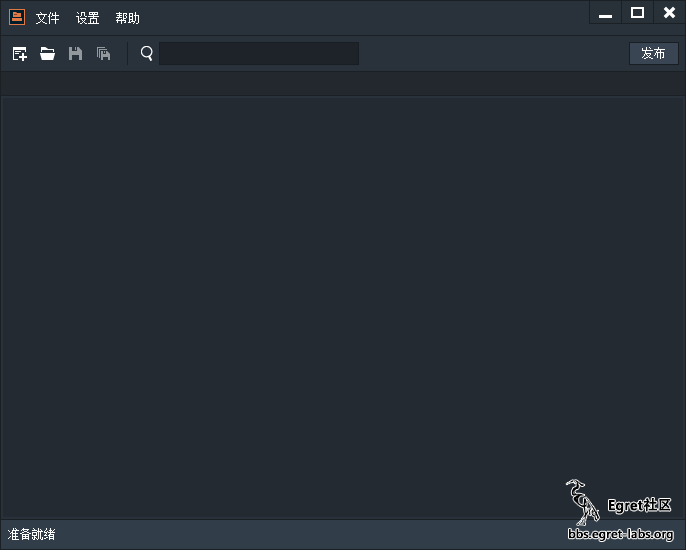
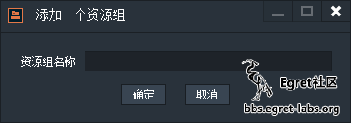
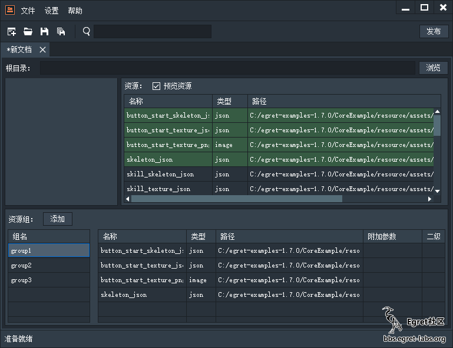
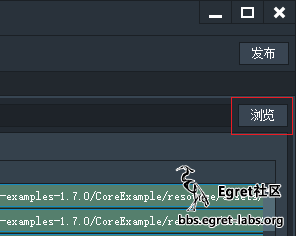
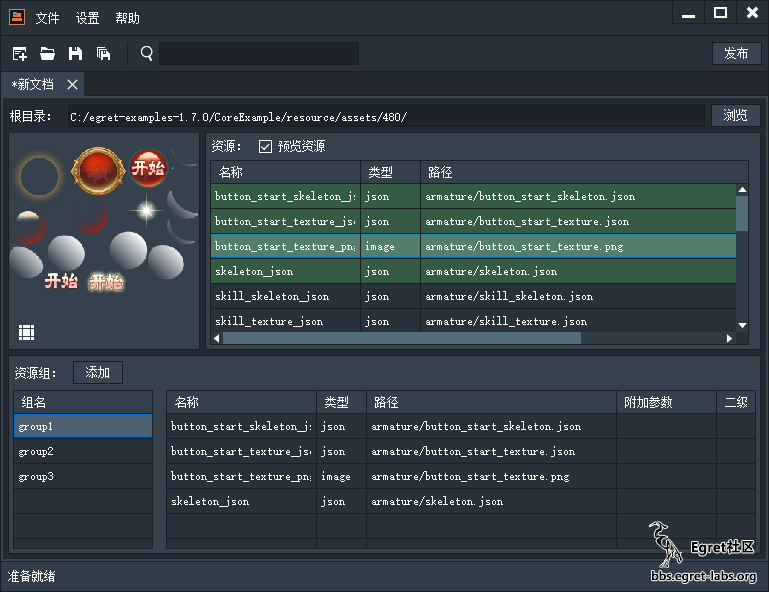
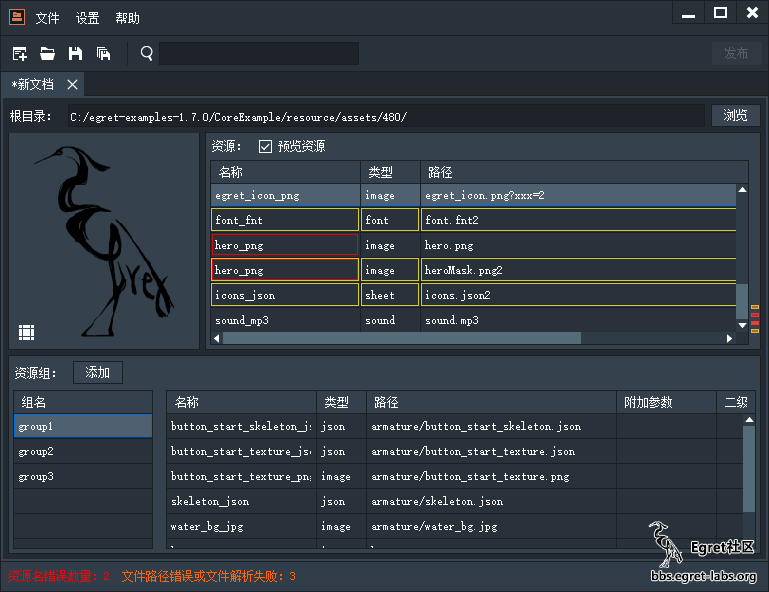
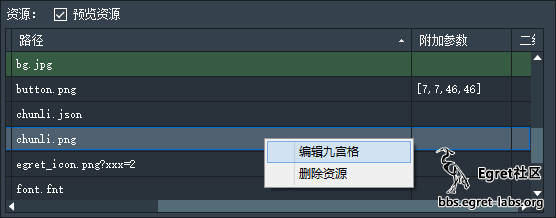
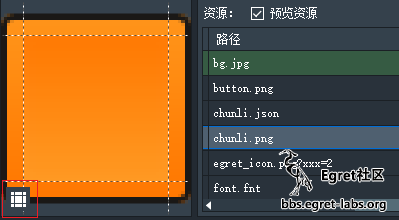
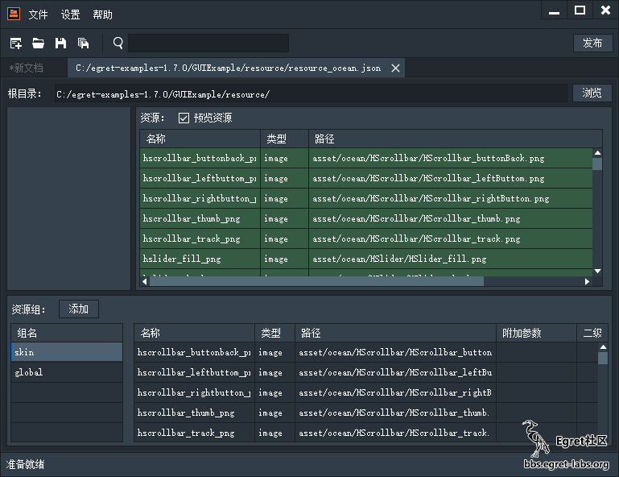
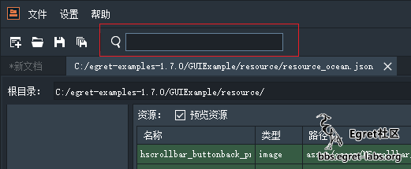

## 简介

ResDepot是针对资源配置文件的创建，编辑和管理工具。可以利用它来创建资源的九宫格数据，也可以对资源配置文件内指定的资源进行分组，发布等功能。发布即就是对资源配置文件内的资源进行合图，同时生成一个新的ResDepot文件，保证在项目代码不改变情况下可以减少资源数目。

ResDepot只是针对资源进行管理的工具，它自身没有项目的概念，它的管理单位是resource.json。

### 适应平台

* Windows
* Mac OS X

### 适应版本

* Egret Engine 1.4.0 版本以及以上

### 下载地址

* [Egret ResDepot 下载地址](http://www.egret.com/downloads/res.html)


## 操作

### 打开 ResDepot



打开的时候是空界面，此时不要慌。您可以采用如下方式继续进行：

* 新建一个资源配置文件
* 打开一个资源配置文件。

### 载入资源

下面我们选择新建然后继续讲解，将CoreExample\resources\assets\480这个目录下的全部资源，全选。拖入到如下的红框框里。



于是资源就被加载进来了。



### 创建组



点击资源组框里的添加按钮会弹出如下对话框：



这里可以用回车键来确认创建。

### 添加组内资源

选中一个组，按住ctrl加选或者shift多选资源框里的资源，然后拖拽资源到红框里。



资源就被添加到了选中资源组中。




### 删除

点击某个选中资源或资源组，按键盘delete键，删除，此时弹出对话框：



这里可以按回车键快速确认。
此删除方式适用于：删除资源、删除资源组、将资源从某个组内移除。


### 设置相对路径




点击根路径后面的浏览，选择项目的资源的根路径。



所有的路径将自动变为相对路径。


> 绝对路径是为了生成相对路径用的，并不会被存储到 resource.json 文件中，而是存储到了ResDepot自身的持久化位置中。所以只需要保证生成的相对路径和别人都是一致的就没问题.

### 错误和警告

在列表内的资源是有可能出现错误的，ResDepot将所有错误的资源都已经给你标识出来了。

红色代表有错误，即资源名重名，或资源组名重名。注意，在有错误的情况下是无法保存资源配置文件的。

黄色代表有警告，如无法根据根目录来拼凑出正确的资源真实路径或sheet内的资源有重名等。警告不会影响文件的保存，但是会影响九宫格的可视化编辑。



### 九宫格编辑

图片资源的九宫格是可以直接在表格上通过输入的方式来编辑的，也可以开启九宫格编辑窗口来可视化编辑：



也可以通过预览图左下角的快捷按钮直接进入：




如上操作完之后，便会出现“编辑九宫格”的菜单，点击之后如下：



如果想编辑九宫格，首先应该勾选左上角的“开启九宫格”复选框。具体对于九宫格的编辑方式如下：（注意：一定要必须设置好根目录之后，才能正确加载图片）

* 鼠标滚轮：缩放
* 拖拽图片：移动图片
* 拖拽虚线：编辑九宫格

### 资源类型设置

如果你想增加某种资源类型对应的文件扩展名，可以再如下这个面板中进行设置：设置->设置



在这里，也可以自行添加其他类型。同时可以设置资源命名的解析规则，以及需要忽视的文件列表等。

### 保存

点击保存之后会自动在选择的目录下生成一个json文件。

### 发布功能

本功能，是自定义一套合图组，然后将 `resource.json` 中图片资源进行合图，然后生成对应的sheet文件，以及新的 `resource.json`。
发布功能即在完成项目准备打包发布的时候，可以利用此功能对已有的资源进行一遍合图，此功能是有别于TextureManager 的，TextureManager 的作用是在开发项目过程中使用。而 ResDepot 的作用是在项目开发完毕的时候使用，并且由 ResDepot 发布得到的资源包是非常不利于编辑和开发使用的，它仅仅是为了使项目内的资源数目变少，减少加载的io开销。所以注意不要在项目开发过程中使用发布功能！

使用方法



如上图。

我们以，GUIExample 的 resource_ocean.json 为例。

用 ResDepot 打开 resource_ocean.json。如下图：




现在有两个资源组，然后点击发布按钮。

> 在组内没有内容，或当前存在错误的时候是无法点击发布按钮的）。



现在是没有合图组的。我们接下来要创建合图组，好让 ResDepot 知道，希望把哪些图片合成一张 sheet。

通过合图组区域右下角的添加按钮我们来添加几个组:




然后它提示拖入资源，此时只需要在未分组资源中选中资源，然后拖住爱到指定的组内即可。如下图：




当将全部的合图组填满后。可以针对每一个组去配置合图的相关配置。




所有对配置的修改都会保存在一个合图配置文件中。在发布前一刻会提示保存合图配置文件。




下面我们来讲解下发布面板顶部这几个勾选分别是什么意思：

* 拷贝未引用文件: 因为有些素材可能不会被添加到resource.json中，所以勾选此熏香会以源目录为基准，在发布的同时拷贝这些不在resource.json中的资源到指定的发布目录中。
* 发布时清空“发布目录”: 由于我们可能会发布很多次，勾选此选项可以在发布的前一刻先将“发布目录”内的资源移动到垃圾回收站中。
* 添加CRC码到文件名: 有时候在我们做了修改之后，可能某个图的内容变了，但是名称却没变，此功能可以将文件本身的crc校验码添加到文件名尾部，但是不会改变生成的resource.json中对该资源引用的key。相当于为您的资源做了版本控制，以免浏览器的缓存造成资源读取错误。


> 合图可能并不会有效减少图片体积，但是可以有效减少资源加载时候的io开销。

### 搜索

如果有什么资源找不到了，可以通过搜索框进行搜索筛选。工具会自动过滤掉不包含搜索关键字的资源条目。



### 快捷键

为了方便，可以直接拖拽新的资源直接到资源组中，此时会将资源载入到 resource.json 的同时也将资源添加到指定的资源组。
快捷键列表：

* ctrl+n：创建组
* ctrl+o：打开一个资源配置的json文件
* ctrl+s：保存当前编辑
* ctrl+f：搜索
* delete：删除资源、删除资源组、将组内资源从组中移除
* 回车键：确认各种提示框。

### 命令行支持

在 1.4.1加入了命令行控制。

#### 命令

* -help 该命令会使得ResDepot弹出帮助界面
* -pack [resource_path] [pack_config_path] [root_directory] 打包
    * resource_path  资源配置文件的绝对路径，如resource.json的绝对路径。
    * pack_config_path  打包配置文件的绝对路径，该文件由ResDepot手动打包过程中可以编辑和生成。
    * root_directory  资源根目录，该目录用于与资源配置内的相对路径拼成绝对路径用的。


#### 用法

ResDepot 的命令行支持是需要打包的配置文件支持的，而该文件只能由ResDepot生成。 所以如果想确保命令行可以打包成功，首先在软件中需要可以打包成功。

其次得启动命令行(mac下启动终端)。如下图所示：



此时回车，将会按照 packConfig.json 来进行打包。