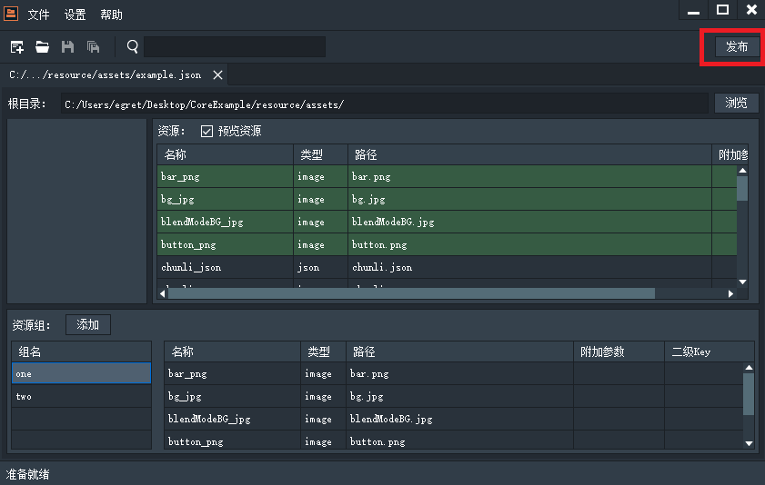
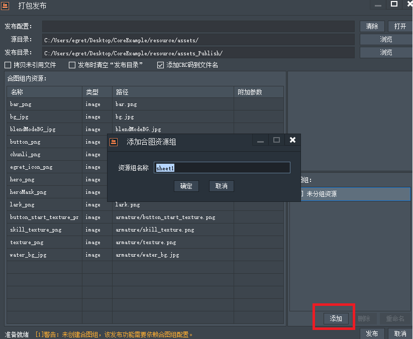

本功能，是自定义一套合图组，然后将 `resource.json` 中图片资源进行合图，然后生成对应的sheet文件，以及新的 `resource.json`。
发布功能即在完成项目准备打包发布的时候，可以利用此功能对已有的资源进行一遍合图，此功能是有别于TextureManager 的，TextureManager 的作用是在开发项目过程中使用。而 ResDepot 的作用是在项目开发完毕的时候使用，并且由 ResDepot 发布得到的资源包是非常不利于编辑和开发使用的，它仅仅是为了使项目内的资源数目变少，减少加载的io开销。所以注意不要在项目开发过程中使用发布功能！

使用方法

如上图。

点击打开，然后选择之前保存的example.json，之后会进入如下界面，点击发布

现在有两个资源组，然后点击发布按钮。

> 在组内没有内容，或当前存在错误的时候是无法点击发布按钮的）。

现在是没有合图组的。我们接下来要创建合图组，好让 ResDepot 知道，希望把哪些图片合成一张 sheet。

通过合图组区域右下角的添加按钮我们来添加几个组:

添加三个组

然后它提示拖入资源，此时只需要在未分组资源中选中资源，然后拖住到指定的组内即可。如下图所示：

注意图中警告，可以按delete将组内资源删除，这样被删除的资源会进入未分组中。

当将全部的合图组填满后。可以针对每一个组去配置合图的相关配置。如下图所示：

所有对配置的修改都会保存在一个合图配置文件中。会提示保存合图配置文件。

下面介绍下发布面板顶部这几个勾选的作用：

* 拷贝未引用文件: 因为有些素材可能不会被添加到resource.json中，所以勾选此选项会以源目录为基准，在发布的同时拷贝这些不在resource.json中的资源到指定的发布目录中。
* 发布时清空“发布目录”: 由于我们可能会发布很多次，勾选此选项可以在发布的前一刻先将“发布目录”内的资源移动到垃圾回收站中。
* 添加CRC码到文件名: 有时候在我们做了修改之后，可能某个图的内容变了，但是名称却没变，此功能可以将文件本身的crc校验码添加到文件名尾部，但是不会改变生成的resource.json中对该资源引用的key。相当于为您的资源做了版本控制，以免浏览器的缓存造成资源读取错误。

> 合图可能并不会有效减少图片体积，但是可以有效减少资源加载时候的io开销。