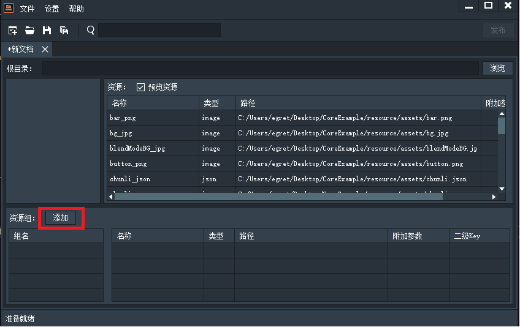
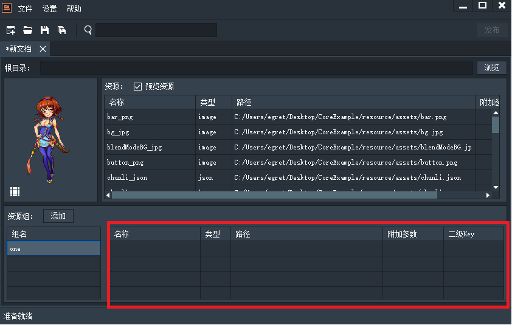
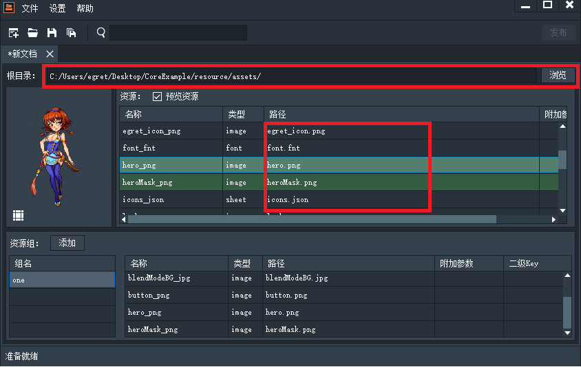

如下图所示，点击图中标出的添加按钮

新建一个分组one

选中一个组，按住ctrl加选或者shift多选资源框里的资源，然后拖拽资源到红框里。如下图所示

资源就被添加到了选中资源组中。可以看到one组中的资源被标记为绿色

选中某个资源文件或者分组，按delete键会弹出如下对话框，也可以选中多个资源批量删除

可以通过选择根目录设置相对路径

点击根路径后面的浏览，选择项目的资源的根路径。如下图红框所示。

如果有资源配置错误，错误的文件会被标记，如下图所示：

