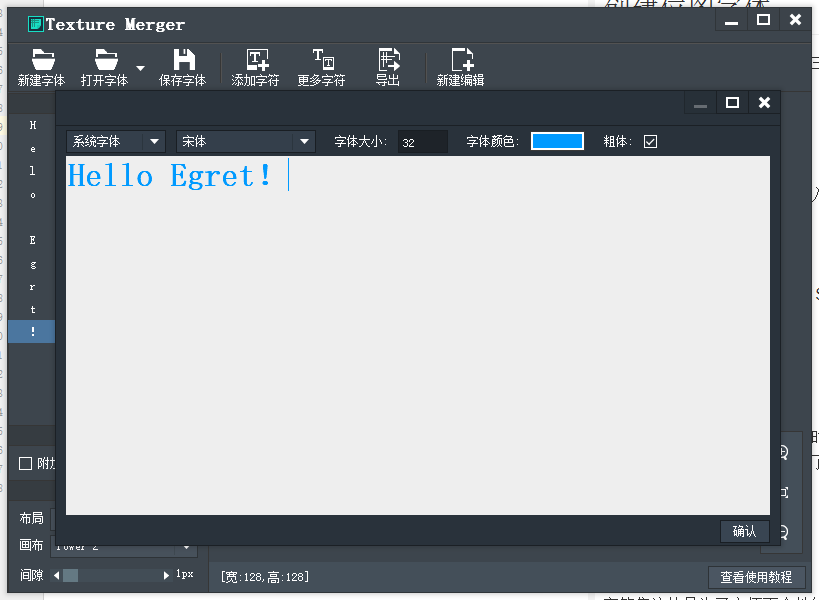
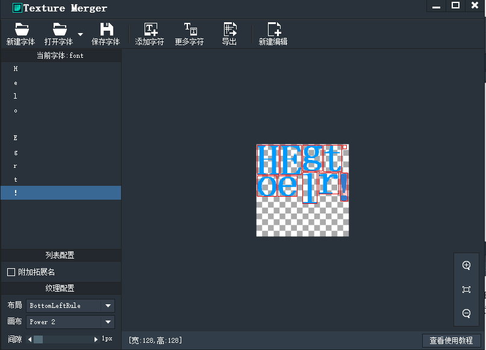
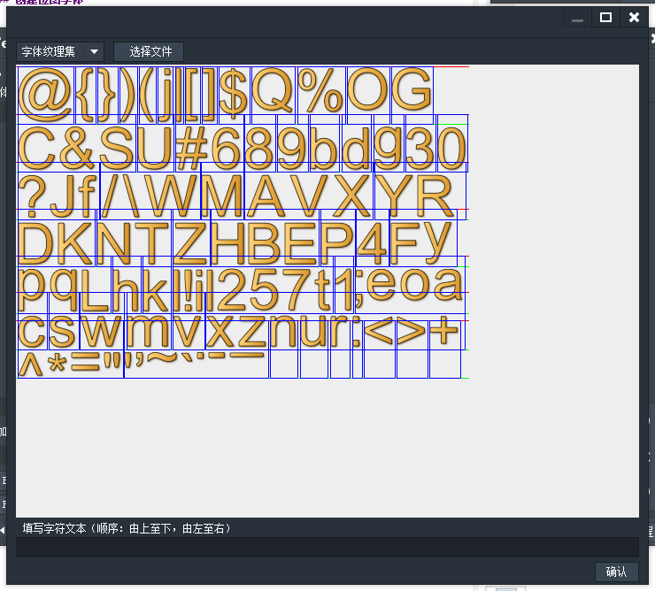
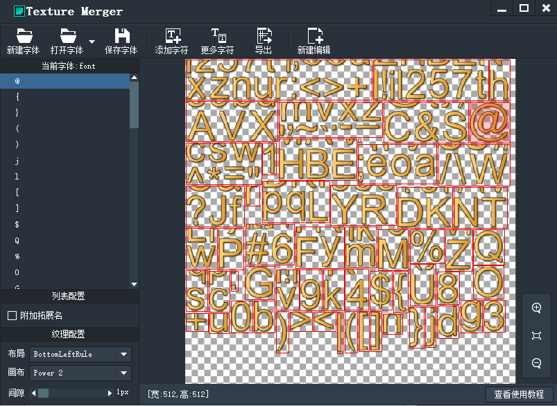

制作纹理字体，这个功能支持三种形式加载方式：

* 散列单个字符图片
* 整张字符集图片
* 系统字体

默认操作是单个字符图片的导入，要想使用其他两种方式可以从“更多字符”中查看。

### 字符图片

单个字符导入比较简单，就跟 SpriteSheet 的操作一样。

### 系统字体

这里可以获取系统的字体，同时可设置字体的大小、颜色、粗细，然后在输入框输入想要的字符就可以了，这里注意了空格字符也是要输入的。
之后点击确定，会看到如下界面：

之后可以导出纹理集和对应的json文件。

### 字符集

字符集这块是为了方便更个性的字体而生的，美术人员可以将画好的字符整齐的排列好导成一张图片，然后用工具导入即可，工具会自动识别每个字符的区域，我们需要做的就是在下面的文本框依次填写对应的文本就行啦。
按顺序输入字符后，点击确定。

