## 简介

Texture Merger 可将零散纹理拼合为整图，同时也可以解析SWF、GIF动画，导出可供Egret使用的配置文件。


### 适应平台

* Windows
* Mac OS X

### 适应版本

* Egret Engine 1.6.0 版本以及以上


### 下载地址

* [Texture Merger 下载地址](http://www.egret.com/downloads/texture.html)

## 类型

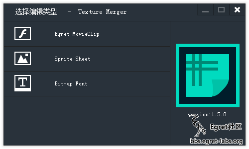

* Egret MovieClip：将 swf 或者 gif 动画转成 Egret MovieClip 需要的相关资源。
* Sprite Sheet：将碎图合成一整张大图。
* Bitmap Font：制作 Egret 位图文本需要的资源。

### Egret MovieClip

Egret Engine 1.5.0 版本对 MovieClip 的数据结构做了调整，允许一个文件包含多个动画。工具方面也允许加载多个动画，不过工具对 swf 的解析程度欠佳，目前还是对 SWF 有要求的：swf 本身必须是个多帧 mc，如果只是作为容器嵌套其他 mc 子项的做法将不会被绘制。对 gif 的要求基本没有，都能绘制出来，但是 gif 动画制作方式的存在不同，可能某些帧不能完全绘制出来。

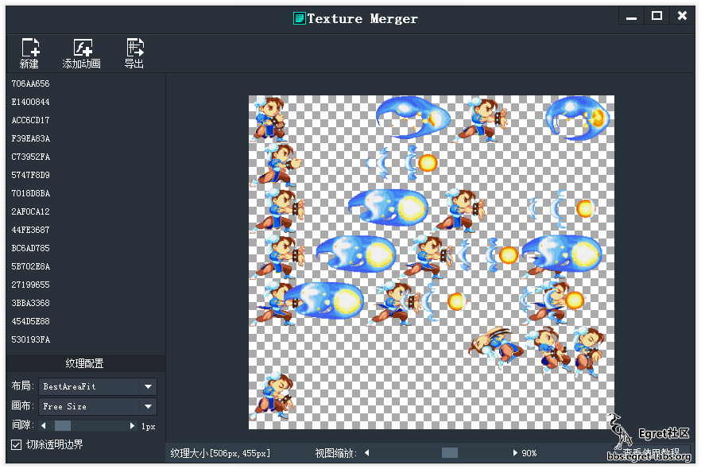

下面我们来看一下，最新的mc数据结构：


```
MovieClip数据格式标准
{
  "file": "icons.png""mc": {
    "mc_name1": {
      "frameRate": 24,
      "labels": [
        {
          "name": "stand",
          "frame": 1
        }
      ],
      "frames": [
        {
          "res": "res_name1",
          "x": 3,
          "y": 0,
          "duration": 2
        }
      ],
      "actions": [
        {
          "name": "action_name1",
          "frame": 1
        }
      ],
      "scripts": [
        {
          "frame": 1,
          "func": "gotoAndPlay",
          "args": [
            "attack"
          ]
        }
      ]
    }
  },
  "res": {
    " res_name1": {
      "x": 170,
      "y": 674,
      "w": 80,
      "h": 110
    }
  }
}
```

```
"file": 该数据文件对应的纹理文件路径 (用于帮助工具匹配对应的问题，引擎中不会解析这个属性) 
"mc": MovieClip数据列表, 
列表中的每个属性都代表一个MovieClip名字
"frameRate": 帧率, 【可选属性】，默认值24，可以由开发者通过代码设定
"labels": 帧标签列表，【可选属性】，如果没有帧标签，可以不加这个属性。
"name": 标签名
"frame": 标签所在的帧序号
"frame": 关键帧数据列表
"res": 该关键帧帧上需要显示的图片资源，【可选属性】，默认值为空（用于空白帧的情况）
"x": 图片需要显示的x坐标, 【可选属性】，默认值0
"y":图片需要显示的y坐标, 【可选属性】，默认值0
"duration": 该关键帧持续的帧数，【可选属性】，默认值1
"actions": 帧动作列表，用于抛出自定义事件，【可选属性】，如果没有帧动作，可以不加这个属性。
"name": 动作名
"frame": 动作所在的帧序号
"scripts": 帧脚本列表，【可选属性】，如果没有帧动作，可以不加这个属性。
"frame": 脚本所在的帧序号
"func": 脚本调用的方法名 支持动画播放相关的的6个API
"args": 脚本调用方法使用的参数列表 【可选属性】，默认值空
"res": 资源列表
列表中的每个属性都代表一个资源名
"x": 资源所在纹理集位置的x坐标
"y": 资源所在纹理集位置的y坐标
"w": 资源宽度
"h": 资源高度
```

> actions、scripts暂时还未启用。

### SpriteSheet

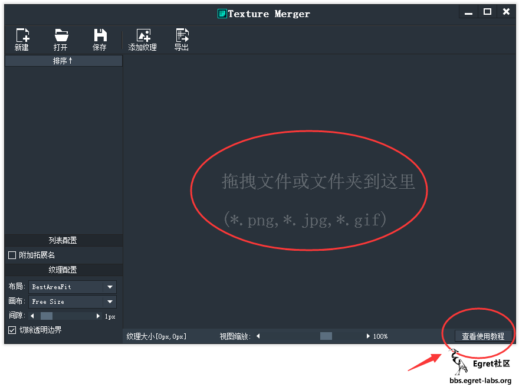

* 工具提供了两种数据导入的方式，拖拽或者点击菜单导入。下面的状态栏有纹理大小、缩放、当前编辑格式的信息。
* 右下角添加了一个查看教程的快捷按钮，有些新童鞋不知道怎么用的可以点这里。

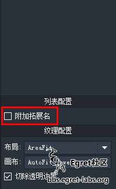
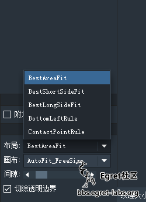

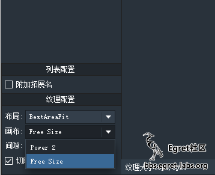

* 附加拓展名的配置可以对纹理名称追加文件的拓展名，比如.png会被追加成_png，这个对Egret MovieClip是无效的，
* 两种自动匹配策略：Power 2，Free Size前者可以得到合适的2的幂的尺寸，后者可以得到合适的自由尺寸。
* 切除透明边界 是指将透明图片周围透明的部分全部切掉。具体效果大家试一下就知道啦。下面我们来导入一些纹理素材。

### 导入纹理素材

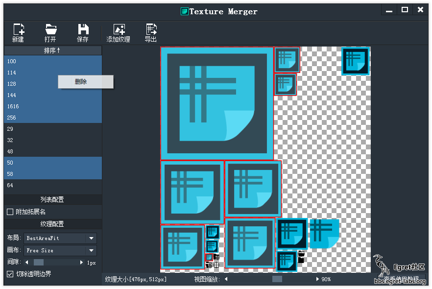

* 导入素材后便可以看到布局好的大纹理，工具对导入的纹理做了去重处理，相同的纹理不会重复显示，只保留纹理名称。
* 左侧有对应的纹理列表，这些名称是跟文件名一致，通过列表可以看到对应的纹理框在大图上的位置，也可以 Ctrl 或者 Shift 键多选后 Delete 删除无用纹理，右键删除选项也可以完成操作。

### 保存与打开

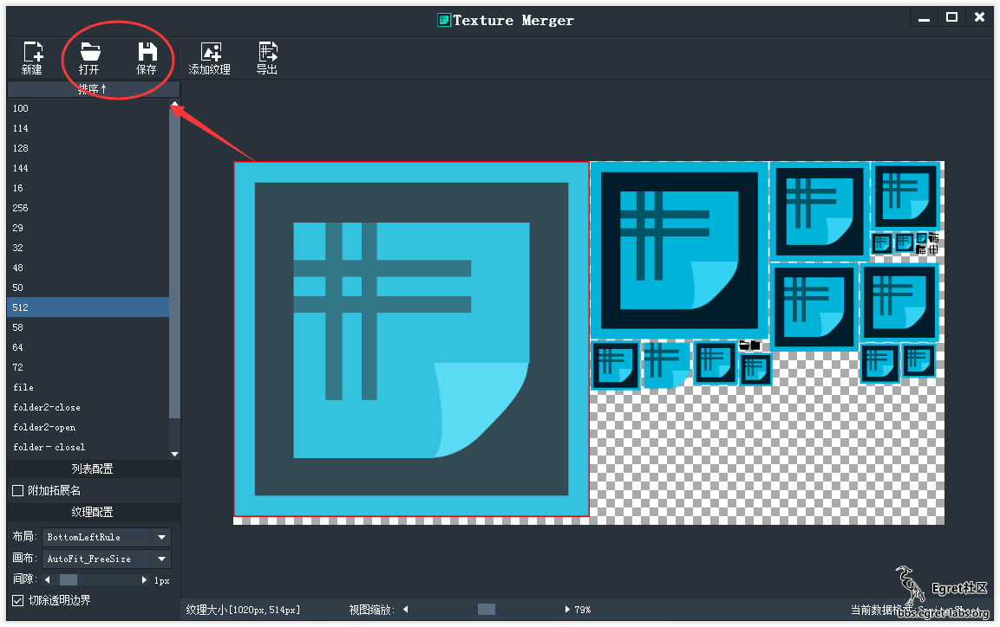

* 把当前编辑的纹理集信息保存为项目文件，方便日后修改

### 新建



如果想继续编辑的话，点击新建，界面就和启动界面一样。

### Bitmap Font

制作纹理字体，这个功能支持三种形式加载方式：

* 散列单个字符图片
* 整张字符集图片
* 系统字体

默认操作是单个字符图片的导入，要想使用其他两种方式可以从“其他字符”中查看。

### 字符图片

单个字符导入比较简单，就跟 SpriteSheet 的操作一样。

### 系统字体

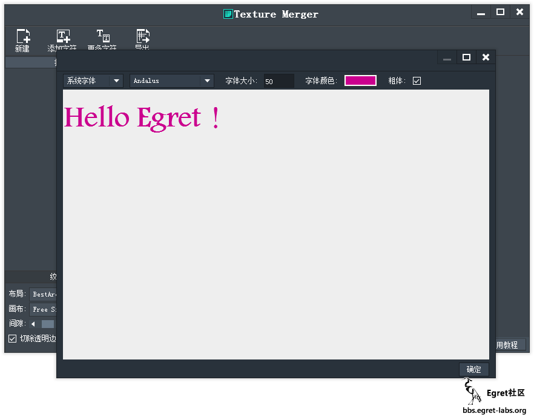

这里可以获取系统的字体，同时可设置字体的大小、颜色、粗细，然后在输入框输入想要的字符就可以了，这里注意了空格字符也是要输入的。


### 字符集

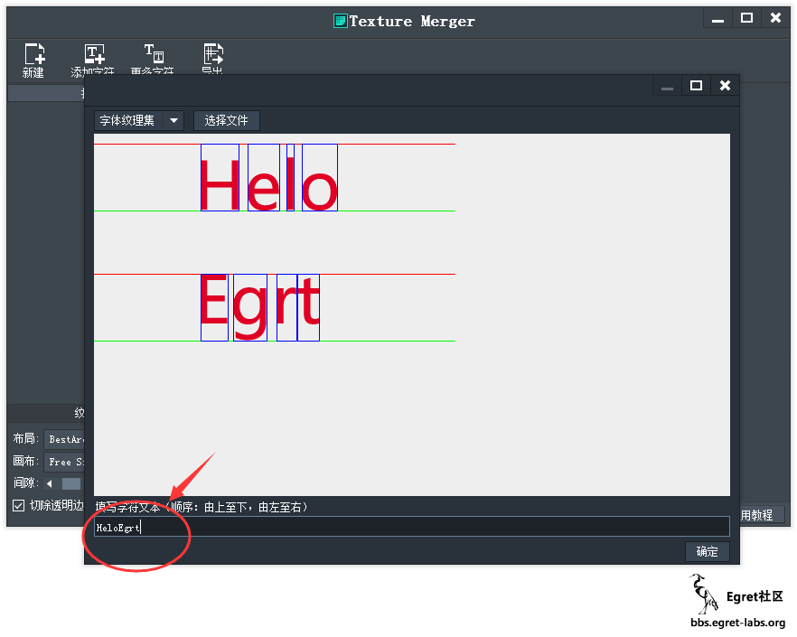

字符集这块是为了方便更个性的字体而生的，美术人员可以将画好的字符整齐的排列好导成一张图片，然后用工具导入即可，工具会自动识别每个字符的区域，我们需要做的就是在下面的文本框依次填写对应的文本就行啦。


## 命令行调用

1.5.2版本的TextureMerger支持简单命令行调用

###  打包命令
* 命令格式：-p [目录] [...] -o [json输出路径] -e [文件筛选正则表达式]

* 命令示例：-p d:/Y1 d:/Y2 -o d:/yyy.json -e /.*\.(jpg|png)，将D盘下Y1、Y2两个目录下所有png，jpg文件打包并输出到d盘的yyy.json。

	-e 为可选命令 不写则默认打包textureMerger支持的所有图片

### 修改json命令
* 命令格式：-rp [json路径] -d [纹理key] [...] -a [文件路径] [...]

* 命令示例：-rp d:/user/aaa.json -d head leg -a d:/user/1.png  d:/user/2.png 修改D盘user目录下的aaa.json 文件，删除key为head、leg的纹理 并添加 1.png 、2.png。此命令覆盖原始文件。-d 与-a 为可选命令

### 转换动画命令
* 命令格式：-mc [目录][...] -o [输出路径] -e [文件筛选正则表达式]

* 命令示例：-mc d:/Y1 d:/Y2 -o d:/outpath -e /.*\.(swf|gif)。将D盘下Y1、Y2两个目录下的所有swf、gif文件进行转换并输出到D盘outpath目录中。

	-e为可选命令 不写默认转换目录下所有被TextureMerger支持的动画文件


## 注意

由于本工具反复对 json 进行编辑后导致图像质量严重下降的问题，这是由于对一张图反复编码、解码导致的，这里我们用了多个PNG编码库进行了测试

* 原图：

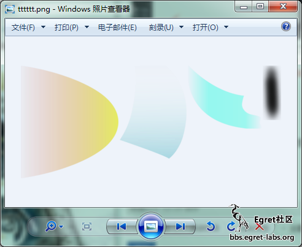


* 反复解码编码20次后的的结果：


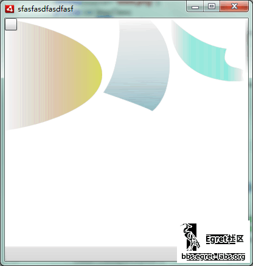

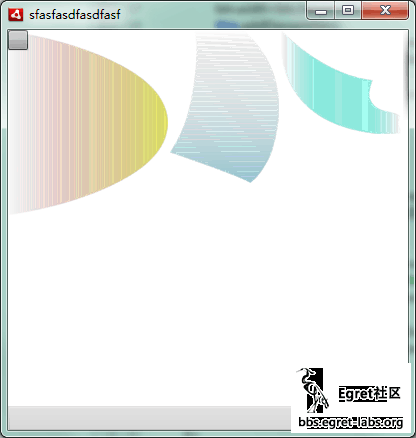

> 以上是两个png编码库执行之后的结果，都已经开启了最高质量。可以看到，第一个相对好一些，但是还是跟原图有了很大差距，至于为什么会出现如此大的差距还有待进一步探究。建议大家在以后维护纹理时尽量保存为项目文件，对项目文件进行二次编辑，而不是直接拖进json文件进行编辑


