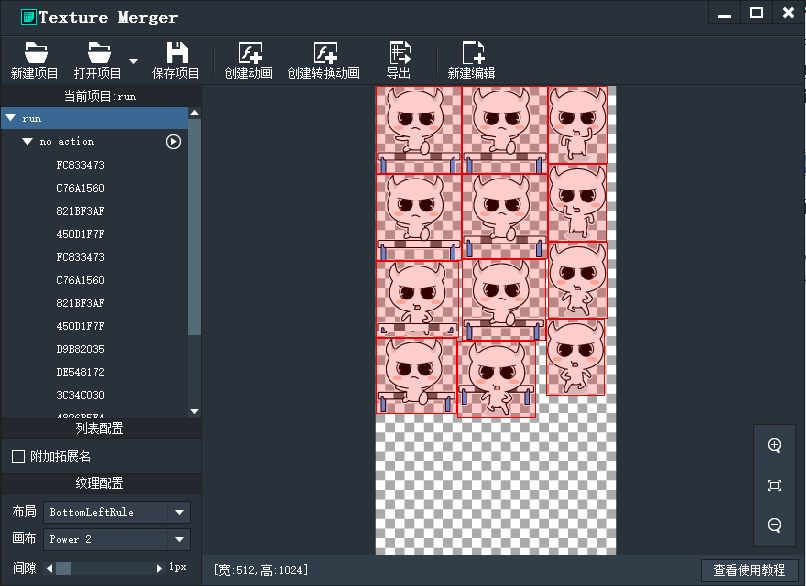
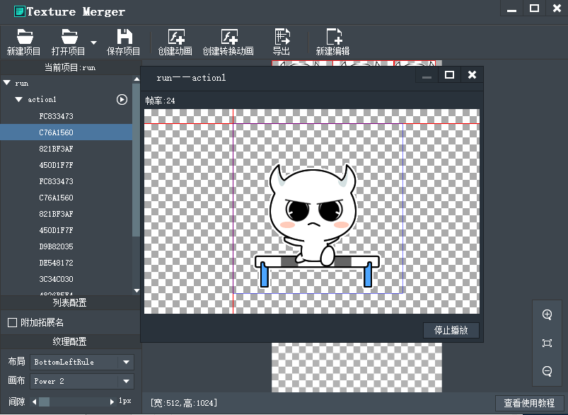
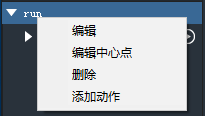
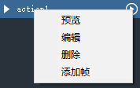
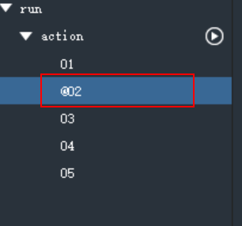

允许一个文件包含多个动画。工具方面也允许加载多个动画，不过工具对 swf 的解析程度欠佳，目前还是对 SWF 有要求的：swf 本身必须是个多帧 mc，如果只是作为容器嵌套其他 mc 子项的做法将不会被绘制。对 gif 的要求基本没有，都能绘制出来，但是 gif 动画制作方式的存在不同，可能某些帧不能完全绘制出来。

下图为拖入一个gif后的界面。



点击项目资源列表中的播放按钮可以预览动画，默认帧率24。



点击导出，可以得到一个纹理集和json配置文件，如图：


也可以拖入多个gif动画，如图：


右键项目或动作可以进行编辑：





点击保存项目，可以保存项目文件，可以方便之后二次编辑。


如何想在某一帧上添加事件也是非常简单的，只需在某一帧的名字前面加上@就可以了，双击某帧就可以更改名字，然后在导出json文件的"events"数组中就会出现相对应标签名，如图：



点开json文件，可以查看mc数据结构：


```
MovieClip数据格式标准
{"mc":{
	"run":{
		"frameRate":24,
		"labels":[
			{"name":"action1","frame":1,"end":16}
			
			],
		"events":[
			{"name":"@02","frame":2}
			],
		"frames":[
			
			{
			"res":"FC833473",
			"x":56,
			"y":67
			},
			{
			"res":"C76A1560",
			"x":56,
			"y":73
			},
			{
			"res":"821BF3AF",
			"x":57,
			"y":67
			},
			省略重复内容...
			]
}},
	"res":{
		"DE548172":{"x":1,"y":1,"w":186,"h":189},
		"E5C6A8B4":{"x":189,"y":378,"w":181,"h":178},
		"FC833473":{"x":377,"y":1,"w":128,"h":168},
		省略重复内容...
	}}
```

```
"mc": MovieClip数据列表, 
列表中的每个属性都代表一个MovieClip名字
"frameRate": 帧率, 【可选属性】，默认值24，可以由开发者通过代码设定
"labels": 帧标签列表，【可选属性】，如果没有帧标签，可以不加这个属性。
"name": 标签名
"frame": 标签所在的帧序号
"end": 标签结束帧序号
"events": 特殊事件【可选属性】
"res": 该关键帧帧上需要显示的图片资源，【可选属性】，默认值为空（用于空白帧的情况）
"x": 图片需要显示的x坐标, 【可选属性】，默认值0
"y":图片需要显示的y坐标, 【可选属性】，默认值0
"res": 资源列表
列表中的每个属性都代表一个资源名
"x": 资源所在纹理集位置的x坐标
"y": 资源所在纹理集位置的y坐标
"w": 资源宽度
"h": 资源高度
```