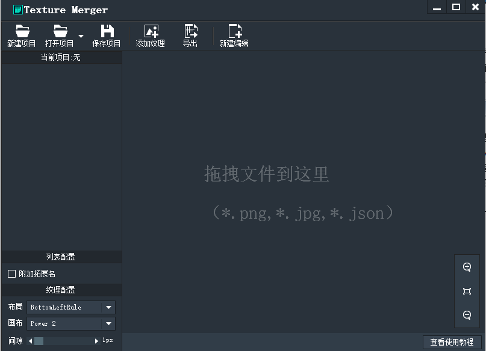
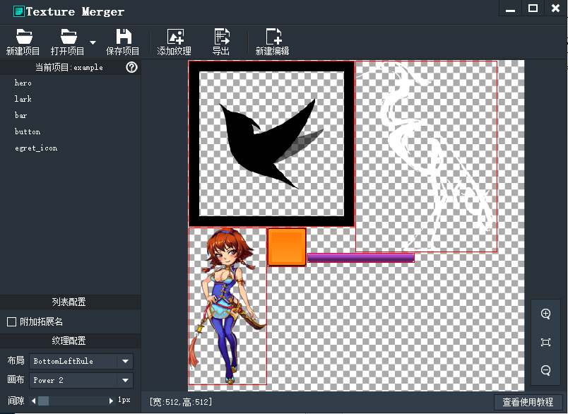
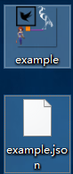

点击新建编辑>SpriteSheet，进入到如下界面

* 工具提供了两种数据导入的方式，拖拽或者点击菜单导入。下面的状态栏有纹理大小、缩放、当前编辑格式的信息。
* 右下角添加了一个查看教程的快捷按钮。
* 附加拓展名的配置可以对纹理名称追加文件的拓展名，比如.png会被追加成_png，这个对Egret MovieClip是无效的，
* 两种自动匹配策略：Power 2，Free Size前者可以得到合适的2的幂的尺寸，后者可以得到合适的自由尺寸。

将零散图片拖入后如下：

点击导出，可以将合成的大图和对应的json文件保存。

